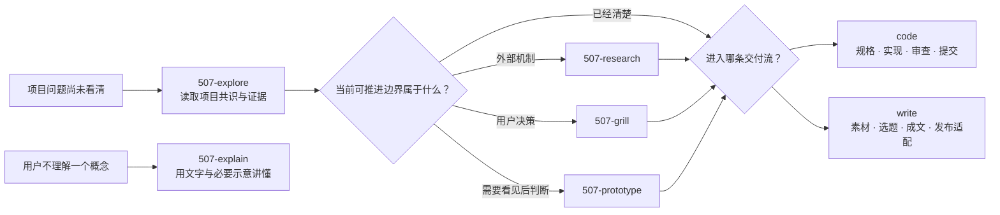

# Agent Skills

一套把工作方法拆成**可独立触发、可组合、以明确产物衔接**的 Agent Skills（智能体技能）。每个 skill 都说明什么时候用、解决什么、产出什么，以及明确不做什么。

本仓库遵循 [Agent Skills 标准](https://agentskills.io/specification)，以 Pi 与 OpenAI Codex 为同等支持的主要宿主。共享 `SKILL.md`（技能说明）只定义动作、边界、产物和验收；宿主专属调度留在使用者自己的 `AGENTS.md`（智能体规范）。

## 适合谁

- 想把“和 Agent 聊聊”变成可复用工作流的人；
- 需要区分调研、对齐、规格化、实施、审查和交付的人；
- 同时使用 Pi、Codex 或其它兼容 Agent Skills 的宿主，希望共用一套方法的人；
- 想按需采用单个 skill，而不是一次引入完整框架的人。

## 工作流

认知入口与交付工作流分层接力：`common/` 先处理项目未知、概念障碍、外部证据和用户决策；问题清楚后，再进入 `code/` 或 `write/` 的具体交付链。



- **代码主链**：`explore（按需） → prd / issue（按需） → 实现 → review → commit（明确要求时）`
- **写作主链**：`mine → fuse → forge → rednote（按需）`，另有 cast、stage、frame、breakdown 与 remix 分支。
- **架构回路**：`inspect → simplify → review`。

| 目录 | 目的 | 入口 |
| --- | --- | --- |
| [`common/`](common/README.md) | 跨代码与写作的探索、概念解释、调研、对齐和移交 | `507-explore`、`507-explain`、`507-research`、`507-grill`、`507-handoff` |
| [`code/`](code/README.md) | 从需求与实现到审查、提交和架构回路 | `507-prd`、`507-fix`、`507-simplify`、`507-review` 等 |
| [`write/`](write/README.md) | 从素材、视频到文章、讲稿、方案与创作包 | `507-mine`、`507-fuse`、`507-forge`、`507-breakdown` 等 |

完整触发词、输入输出和职责边界以各目录的 `SKILL.md` 为准。

## 通用认知入口

| Skill | 动作 |
| --- | --- |
| `507-explore` | 只读探索项目未知，在会话中维护已知、未知、`frontier（当前可推进边界）`与证据边界 |
| `507-explain` | 把用户不理解的单个概念讲懂，必要时使用表格、`Mermaid（图表语法）`或 `ASCII（字符图）`示意 |
| `507-research` | 核实外部事实与机制，产出可交给解释、探索、写作或决策使用的证据包 |
| `507-grill` | 沿依赖关系对齐只有用户能够决定的意图、边界与风险取舍 |
| `507-handoff` | 中断、换会话或转交时输出临时交接摘要 |

## 代码交付入口

| Skill | 动作 |
| --- | --- |
| `507-setup` | 初始化项目工作规范或执行全量规范检查 |
| `507-prd` | 把对话或方案沉淀成 PRD 需求规格 |
| `507-issue` | 把任务写成可上传 GitHub、可被领取的 issue |
| `507-prototype` | 在正式实现前用可丢弃原型验证具体问题 |
| `507-fix` | 建反馈环，最小修复 bug、报错、回归或冲突 |
| `507-test` | 测试是主任务时补测、运行和缩小失败范围 |
| `507-tdd` | 明确 test-first/TDD 时按红绿重构实施 |
| `507-simplify` | 保持外部行为不变，简化内部模块、抽象和接缝 |
| `507-map` | 以代码为证据，只维护 README/doc 项目地图 |
| `507-review` | 审查任意明确交付范围的规范、需求与质量 |
| `507-commit` | 明确要求提交时，验证、精确暂存并创建本地 commit |
| `507-inspect` | 只读寻找架构摩擦并输出完整证据报告 |
| `507-handoff` | 中断、换会话、压缩上下文或转交时输出临时交接摘要 |

## 安装

先 fork（派生）或 clone（克隆）仓库，再将它链接到两个宿主都支持的用户级技能目录：

```bash
mkdir -p ~/Workspace/Skills ~/.agents/skills
cd ~/Workspace/Skills
git clone https://github.com/ssdiwu/507-skills.git
ln -s ~/Workspace/Skills/507-skills ~/.agents/skills/507-skills
```

当前版本的 [Pi](https://github.com/badlogic/pi-mono/blob/main/packages/coding-agent/README.md) 与 [Codex](https://developers.openai.com/codex/build-skills#where-to-save-skills) 文档都将 `~/.agents/skills/` 列为用户级技能目录，并支持符号链接。这个发现位置属于宿主实现约定，不是 Agent Skills 标准本身；新增或修改 skill 后若没有立即出现，重开对应会话。

## 使用

### 自然语言触发

skill 的 `description`（描述）保留常用动作词，两个宿主都可按意图自动加载。例如：

- “先帮我看看这个问题在项目里的位置和未知边界” → `507-explore`
- “用流程图讲清楚状态机是什么” → `507-explain`
- “修复这个回归，先建立复现” → `507-fix`
- “校准这个目录的 README 和项目地图” → `507-map`
- “审查这个分支相对 main 的全部改动” → `507-review`
- “用 TDD 做这个功能” → `507-tdd`
- “把 inspect 报告逐项处理完” → `507-simplify`

### 显式调用

需要强制使用某个技能时，使用宿主原生语法：

```text
Pi:    /skill:507-review
Codex: $507-review
```

两端允许使用不同工具和调度方式，但必须保持触发条件、修改权限、停止位置、产物和验证标准一致。

## 配套 Agent 配置

[`templates/AGENTS.global.example.md`](templates/AGENTS.global.example.md) 提供宿主中立的全局 `AGENTS.md` 示例。复制到自己的宿主配置后，再按该宿主可用工具补充调度规则；不要把个人称呼、机器路径、私有仓库或凭据同步回公开仓库。

项目局部约束始终优先于全局习惯。

## 设计原则

1. **一 skill 一动作**：相邻能力靠明确产物和路由接力，不用总控技能吞并。
2. **以产物接力**：碎片、候选 idea、PRD、issue、证据报告和 commit 是阶段交接物。
3. **流程可跳过**：每个 skill 可独立触发，完整链路是地图，不是强制仪式。
4. **结果跨宿主一致**：共享技能不写 Pi/Codex 条件分支；工具过程可以不同。
5. **先证据后优化**：先定位真实问题、失败样例或验证信号，再扩大工作量。
6. **安全默认**：不提交密钥、个人/客户资料或未经授权的素材；外部密钥只通过环境变量传入。

## 依赖与边界

多数 skill 是纯 Markdown（标记语言）工作流，无额外依赖。带脚本的写作 skill 会在自身说明中列出运行时依赖和环境变量。请先阅读对应目录的 `README.md`。

本仓库不包含任何 API key（接口密钥）、账号 Cookie（会话凭据）、个人 vault（知识库）或客户材料。详见 [`SECURITY.md`](SECURITY.md)。

## 贡献与发布

- 贡献方式见 [`CONTRIBUTING.md`](CONTRIBUTING.md)。
- 安全问题见 [`SECURITY.md`](SECURITY.md)。
- 变更记录见 [`CHANGELOG.md`](CHANGELOG.md)。
- 使用条款见 [`LICENSE`](LICENSE)。

欢迎提 issue（问题单）讨论 skill 边界、可复现失败和跨宿主行为。个人偏好优先留在自己的 `AGENTS.md` 或 fork 中。
