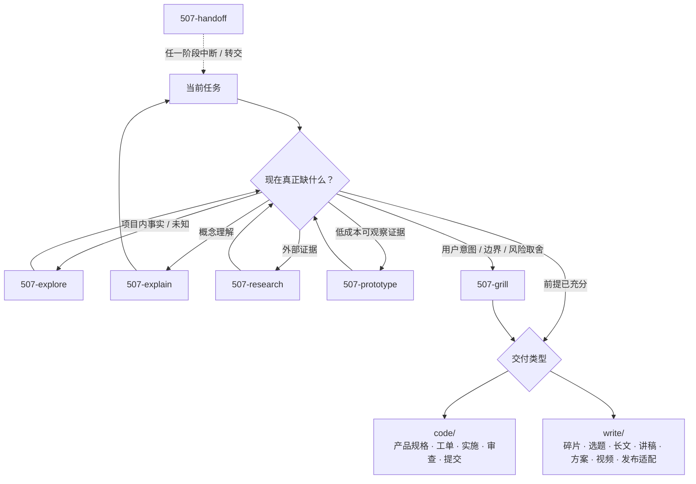

# Agent Skills

一套把工作方法拆成**可独立触发、可组合、以明确产物接力**的 Agent Skills（智能体技能）。每个 skill 都说明什么时候用、解决什么、产出什么、何时结束，以及可能接到哪里。

本仓库遵循 [Agent Skills 标准](https://agentskills.io/specification)，以 Pi 与 OpenAI Codex 为同等支持的主要宿主。共享 `SKILL.md`（技能说明）定义动作、边界、产物、验收和出口合同；宿主专属调度留在使用者自己的 `AGENTS.md`（智能体规范）。

## 适合谁

- 想把“和 Agent 聊聊”变成可复用工作流的人；
- 需要区分证据、决策、规格、实施、审查和交付的人；
- 同时使用 Pi、Codex 或其它兼容 Agent Skills 的宿主，希望共用一套方法的人；
- 想按需采用单个 skill，而不是一次引入完整框架的人。

## 工作流定义

`common/` 是**横向层**，不是进入 `code/` 或 `write/` 前必须依次通过的阶段。项目未知、概念障碍、外部证据、用户决策和会话移交可以在任意时点出现；任务已经清楚时直接进入交付动作。

`507-prototype` 位于 `code/`，但在流程上属于**前置证据层**：只有一个具体未知能低成本观察、且学习收益高于制作与清理成本时才进入，再把 verdict（结论）送回探索、对齐、PRD、issue 或实施。



流程图是导航，不是强制仪式。一个 skill 可以有多个候选出口；Agent 根据当前目标、证据和出口合同选择下一步，并用一句话向用户解释“现在用什么、为什么”。用户只决定其真正拥有的意图与取舍，不负责记忆或选择 skill 名称。

## 两条交付线

### 代码与产品

```text
explore / research / prototype / grill（均按需）
                    ↓
        PRD / issue / 直接实施（按耐久载体需要选择）
                    ↓
    fix / test / tdd / simplify / 正常实现
                    ↓
              review → commit（明确要求时）
```

issue 支持 `draft（对话草稿）→ investigation（调查态）→ ready（执行态）`；调查和执行默认共用同一个远程 issue，证据进评论，当前结论回写正文，标签与负责人在每个远程状态都按仓库规范核验。

### 写作与内容

```text
素材 / 想法 / research 证据 → mine → fuse ─┬→ forge → rednote（按需）
                                             └→ stage
碎片成熟簇 → cast

已确认的人类方案需求 → frame

视频 → breakdown ─┬→ mine（挖内容观点）
                   └→ remix（借创作手法）
```

`grill` 贯穿需要用户确认的中心判断、方案边界和发布承诺；`frame` 只写面向人的活动、培训、合作或项目方案，具体软件产品规格归 `prd`。

## 目录

| 目录 | 目的 | 主要入口 |
| --- | --- | --- |
| [`common/`](common/README.md) | 跨代码与写作的横向认知、证据、决策和移交能力 | `507-explore`、`507-explain`、`507-research`、`507-grill`、`507-handoff` |
| [`code/`](code/README.md) | 前置原型证据、产品规格、工单、实现、审查、提交和架构回路 | `507-prototype`、`507-prd`、`507-issue`、`507-fix`、`507-review` 等 |
| [`write/`](write/README.md) | 从素材、观点和视频到文章、讲稿、方案、创作包与发布适配 | `507-mine`、`507-fuse`、`507-forge`、`507-frame`、`507-breakdown` 等 |

## Skill 速查

### 横向层

| Skill | 动作 |
| --- | --- |
| `507-explore` | 只读探索项目未知，在会话中维护已知、未知、当前可推进边界与证据边界 |
| `507-explain` | 把用户不理解的单个概念讲懂，必要时使用表格、Mermaid 或 ASCII 示意 |
| `507-research` | 核实外部事实与机制，产出可被下一步直接消费的证据交接 |
| `507-grill` | 先查事实，再沿依赖关系对齐只有用户能够决定的意图、边界与风险取舍 |
| `507-handoff` | 中断、换会话或转交时输出脱敏的临时交接摘要 |

### 代码与产品

| Skill | 动作 |
| --- | --- |
| `507-setup` | 初始化项目工作规范或执行全量规范巡检 |
| `507-prototype` | 用成本可控的可丢弃原型获得前置证据与 verdict |
| `507-prd` | 把已确认的具体产品需求沉淀成可验证规格 |
| `507-issue` | 草拟、创建和维护调查态到执行态的 GitHub issue 生命周期 |
| `507-fix` | 建反馈环，最小修复 bug、报错、回归或冲突 |
| `507-test` | 测试是主任务时补测、运行和缩小失败范围 |
| `507-tdd` | 明确 test-first/TDD 时按红绿重构实施 |
| `507-simplify` | 保持外部行为不变，简化内部模块、抽象和接缝 |
| `507-map` | 以代码为证据，只维护 README/doc 项目地图 |
| `507-review` | 审查明确交付范围的规范、需求与质量 |
| `507-commit` | 明确要求提交时，验证、精确暂存并创建本地 commit |
| `507-inspect` | 只读寻找架构摩擦并输出完整证据报告 |

### 写作与内容

| Skill | 动作 |
| --- | --- |
| `507-mine` | 把想法、指定素材或 research 证据变成可复用碎片与观点 |
| `507-fuse` | 比较竞争解释，把碎片组合成候选 idea |
| `507-cast` | 把成熟碎片簇聚合成知识库主题页 |
| `507-forge` | 把已成立创意与证据锻造成可发布书面主稿 |
| `507-stage` | 把已确认内容编排为讲稿、PPT 或课程现场内容 |
| `507-frame` | 把已确认的人类方案需求写成活动、培训、合作或项目方案 |
| `507-breakdown` | 把一个视频编译成可核验的 `video_completed` 拉片包 |
| `507-remix` | 从完成拉片包借创作手法，重组为原创视频创作包 |
| `507-rednote` | 把成熟书面主稿保真改编并渲染为小红书图片文章 |

完整触发词、输入输出、验收与出口以各目录的 `SKILL.md` 为准。

## 安装

先 fork（派生）或 clone（克隆）仓库，再将它链接到两个宿主都支持的用户级技能目录：

```bash
mkdir -p ~/Workspace/Skills ~/.agents/skills
cd ~/Workspace/Skills
git clone https://github.com/ssdiwu/507-skills.git
ln -s ~/Workspace/Skills/507-skills ~/.agents/skills/507-skills
```

当前版本的 [Pi](https://github.com/badlogic/pi-mono/blob/main/packages/coding-agent/README.md) 与 [Codex](https://developers.openai.com/codex/build-skills#where-to-save-skills) 文档都将 `~/.agents/skills/` 列为用户级技能目录，并支持符号链接。这个发现位置属于宿主实现约定，不是 Agent Skills 标准本身；新增或修改 skill 后若没有立即出现，重开对应会话。

## 使用

skill 的 `description`（描述）保留常用动作词，宿主可按用户意图自动加载。例如：

- “先看看项目里现在知道什么、还缺什么” → `507-explore`
- “查清这个外部项目实际怎么做” → `507-research`
- “把这个观点挖成碎片” → `507-mine`
- “这个假设先做个便宜原型验证” → `507-prototype`
- “把调查中的 issue 补证后转成执行工单” → `507-issue`
- “把这篇主稿做成小红书图卡” → `507-rednote`

需要强制使用某个技能时，使用宿主原生语法：

```text
Pi:    /skill:507-review
Codex: $507-review
```

两端允许使用不同工具和调度方式，但必须保持触发条件、修改权限、停止位置、产物、验收与出口合同一致。

## 配套 Agent 配置

[`templates/AGENTS.global.example.md`](templates/AGENTS.global.example.md) 提供宿主中立的全局 `AGENTS.md` 示例。复制到自己的宿主配置后，再按该宿主可用工具补充调度规则；不要把个人称呼、机器路径、私有仓库或凭据同步回公开仓库。

项目局部约束始终优先于全局习惯。

## 设计原则

1. **一 skill 一动作**：相邻能力靠明确产物和路由接力，不用总控技能吞并。
2. **横向能力按需调用**：common 不是前置仪式；事实、理解、证据和决策在哪一层出现，就在哪里调用。
3. **出口合同显式**：每个 skill 声明完成信号、产物、候选出口与回退条件。
4. **Agent 负责路由**：用户决定真实意图与取舍，Agent 选择并解释 skill，不把框架学习成本转给用户。
5. **流程可跳过**：完整链路是地图，不是强制流水线。
6. **结果跨宿主一致**：共享技能不写 Pi/Codex 条件分支；工具过程可以不同。
7. **先证据后优化**：先定位真实问题、失败样例或验证信号，再扩大工作量。
8. **安全默认**：不提交密钥、个人/客户资料或未经授权的素材；外部密钥只通过环境变量传入。

## 依赖与边界

多数 skill 是纯 Markdown（标记语言）工作流，无额外依赖。带脚本的写作 skill 会在自身说明中列出运行时依赖和环境变量。请先阅读对应目录的 `README.md`。

本仓库不包含任何 API key（接口密钥）、账号 Cookie（会话凭据）、个人 vault（知识库）或客户材料。详见 [`SECURITY.md`](SECURITY.md)。

## 贡献与发布

- 贡献方式见 [`CONTRIBUTING.md`](CONTRIBUTING.md)。
- 安全问题见 [`SECURITY.md`](SECURITY.md)。
- 变更记录见 [`CHANGELOG.md`](CHANGELOG.md)。
- 使用条款见 [`LICENSE`](LICENSE)。

欢迎提 issue（问题单）讨论 skill 边界、可复现失败和跨宿主行为。个人偏好优先留在自己的 `AGENTS.md` 或 fork 中。
