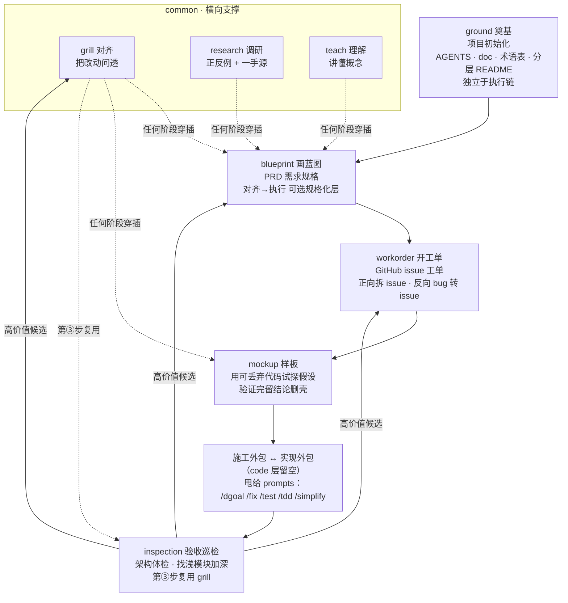

# code/ 代码工作流

507 的代码工作流，按**建造隐喻**命名——把代码工程类比为建造工序：奠基整地、画蓝图、做样板、施工、验收巡检。

## 建造隐喻命名体系

code 流的主链用**建造工序**命名，因为代码工程和建造同构——都有"设计→外包施工→验收"的角色分离：

```
ground（奠基）  →  blueprint（画蓝图）  →  workorder（开工单）  →  mockup（样板）
项目初始化            PRD 需求规格          GitHub issue 工单        用可丢弃代码试探假设
                         ↓                        ↓                          ↓
                    [施工外包 ↔ 实现外包]      code 层不碰实现，甩给 prompts
                                                /dgoal /fix /test /tdd /simplify
                                                ↓
                                            inspection（验收巡检）
                                            架构体检 · 找浅模块加深
```

- **ground 奠基**：搭项目骨架、初始化规范（AGENTS.md / doc / 术语表 / 分层 README）
- **blueprint 画蓝图**：把方案/对话落成 PRD 需求规格——想清楚要做什么
- **workorder 开工单**：把任务落成可上传 GitHub、可被 AI 领取的 issue 工单——把要做的事写成可领取的执行单元
- **mockup 样板**：用可丢弃代码在正式实现前验证一个设计假设，锚回"验证设计的试做件"原义
- **inspection 验收巡检**：架构体检，找浅模块、加深机会

**同构核心**：建造链天然有"设计院画图、施工队施工、监理验收"的三角色分离——恰好映射 code 层"blueprint 画图不实现、workorder 开工单、prompts 实现、inspection 验收"。中间的"施工外包"对应 code 层把实现甩给 prompts，这一环是 code 层结构的真实形态，不是缺陷。

**blueprint 和 workorder 的分工**：blueprint 画蓝图（PRD 需求规格，想清楚要做什么），workorder 开工单（GitHub issue，把要做的事写成可领取的执行单元）。重任务两者都走，轻任务都可跳过直接执行。

## 每个 skill 的介绍

### 环境维度（独立于执行链）

#### `507-ground` 奠基
为一个或多个代码项目做 507 工作流初始化/巡检。检查项目自己的 AGENTS.md、doc/、doc/术语表.md、doc/决策档案/、分层 README 和已口述但未沉淀的约束。
- 不在执行链里，是项目环境维度的入口，可独立运行
- 触发："setup 507""项目初始化""巡检这些项目"

### 执行主链

#### `507-blueprint` 画蓝图
把当前对话、方案或 PRD 沉淀成 **PRD（产品需求文档）**——需求规格，回答要解决什么问题、给谁、怎么验证。是对齐→执行之间可选的规格化层。
- 轻任务跳过它直接执行；重任务或需留档的需求先画蓝图再执行
- **不拆 issue 工单**（归 `507-workorder`）、不做架构体检（归 `507-inspection`）
- 触发：“写 PRD”“把刚才整理成需求”“形成需求文档”“to-prd”

#### `507-workorder` 开工单
把任务结构化成可上传 GitHub、可被 AI 领取执行的 **issue 工单**。正向把方案/PRD 拆成可领取 issue，反向把 bug/gap 落成可追踪 issue。模板以 507 实际 issue 实践为骨架（正向八板块 + 反向现象/影响/方案/验收/风险）。
- **issue 即执行合同**——issue 写得足够完整，AI 领取后照着做，不另产 Agent Brief（融入 issue）
- blueprint 的可选下游（PRD 想清楚再开工单），也可独立触发（bug 直接开工单）
- 触发：“拆 issue”“开 issue”“让 AI 领取”“bug 转 issue”“记个 bug”

#### `507-mockup` 样板
用 throwaway prototype（可丢弃原型）在正式实现前回答一个具体问题。两条分支：逻辑/状态模型做可交互终端原型，UI/视觉方向做多个可切换页面变体。
- 锚回工程原义"验证设计的试做件"，锁**试探**语义；丢弃性在正文（"从第一天标记为 throwaway""回答完就删除或吸收"）
- 触发："做个原型""prototype""让我玩一下""先验证这个模型"

#### `507-inspection` 验收巡检
给代码库做架构体检，找"加深机会"——把浅模块改深。先只读探索找摩擦点，出候选报告，选定后调用 507-grill 拷问设计，接口设计那步可用 pi 自递归并行脑暴 3 个方案。
- 建议每隔几天跑一次
- 选定候选后第③步直接复用 `507-grill`
- 触发："架构体检""找重构机会""代码是不是该收拾了""inspection""improve-arch"

### 通用层（见 common/）

- **`507-grill`** 决策树追问：开工前对齐，把改动/方案问透，沉淀进项目 doc/。inspection 第③步复用它。
- **`507-research`** 调研借鉴：核实外部参照物真实机制（正反例 + 一手源），判断借鉴意义。
- **`507-teach`** 概念解释器：讲懂不懂的概念，默认不落盘。

## 工作流

### ASCII 版

```
                      【common · 横向支撑，贯穿全链】
        grill 对齐            research 调研          teach 理解
       （把改动问透）        （正反例 + 一手源）     （讲懂概念）
            │                     │                     │
            └──────── 任何阶段穿插调用 ──────────────────┘
                      （grill 还被 inspection 第③步复用）


  ┌─ ground ────────────────────────────────────────────────┐
  │  奠基 / 项目初始化                                    │
  │  AGENTS.md · doc/骨架 · 术语表 · 分层 README              │
  │  独立于执行链，可单独运行；新项目时作为链的起点            │
  └────────────────────────────────────────────────────────┘
                          │
                          ▼
  ┌─ blueprint ────────────────────────────────────────────┐
  │  画蓝图 / 把方案落成 PRD 需求规格                        │
  │  对齐→执行之间可选的规格化层·轻任务可跳过             │
  └────────────────────────────────────────────────────────┘
                          │
                          ▼
  ┌─ workorder ────────────────────────────────────────────┐
  │  开工单 / 把任务落成可领取的 GitHub issue               │
  │  正向拆 issue · 反向 bug 转 issue · issue 即执行合同    │
  └────────────────────────────────────────────────────────┘
                          │
                          ▼
  ┌─ mockup ────────────────────────────────────────────┐
  │  做样板 / 用可丢弃代码试探一个假设                    │
  │  逻辑原型(TUI) 或 UI 变体 · 验证完留结论删壳              │
  └────────────────────────────────────────────────────────┘
                          │
                          ▼
  ╔═ 施工外包 ↔ 实现外包（code 层留空）══════════════════════╗
  ║   设计院不施工，施工队施工——code 层不实现，甩给 prompts  ║
  ║                                                          ║
  ║     /dgoal    持续执行到完成                              ║
  ║     /fix      修 bug / 冲突                               ║
  ║     /test     补测试 / 缩小失败范围                       ║
  ║     /tdd      红绿重构                                    ║
  ║     /simplify 局部行为不变清理                            ║
  ╚══════════════════════════════════════════════════════════╝
                          │
                          ▼
  ┌─ inspection ────────────────────────────────────────────┐
  │  验收巡检 / 架构体检                                      │
  │  找浅模块 · 加深机会 · 候选报告                            │
  │  选定候选后第③步调用 507-grill 拷问设计                       │
  └────────────────────────────────────────────────────────┘
                          │
                          ▼
            高价值候选 → grill 深挖
                       或 blueprint 落 PRD / workorder 开工单（回路进下一轮）
```

### Mermaid 版



**关键回路**：inspection 的高价值候选不直接动手，回到 grill 深挖或 blueprint 拆 issue，进入下一轮。链不是一次性直线，是螺旋。

## 纪律

- 每个 skill 可独立触发，不强制走完整条链
- blueprint 和 mockup 可穿插，非严格线性——可以先 mockup 验证假设再 blueprint 落规格，也可以先 blueprint 再按需 mockup
- 代码流 skill 共享一套架构词汇（module / interface / seam / adapter / depth / leverage / locality），见各自 SKILL.md
- 阶段之间用"输出物"衔接：对齐结论 → blueprint 的 PRD → workorder 的工单 → 实现 → inspection 的报告
- 实现环节（施工外包）不在 code 层，走 prompts；code 层只管"画图、试做、验收"