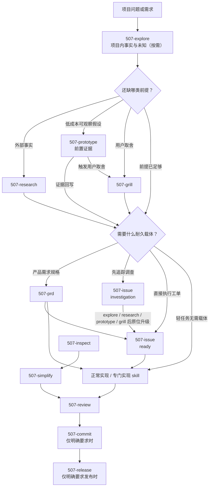

# code/ 代码工作流

代码工作流使用功能直译名称，让 skill（技能）的调用入口直接对应用户动作。每个 skill 都可独立触发；下面的完整链路只用于导航，不是强制流程。

## 工作流地图

`507-handoff`（会话移交）位于 [`common/`](../common/README.md)，任何阶段需要中断、换会话、压缩上下文或转交时都可使用。

## 通用探索与项目初始化

### `507-explore` 项目探索（common）

项目问题尚未看清时的只读起手式。先读文档和代码依据，在会话中区分已知、未知、`frontier（当前可推进边界）`与证据边界，再路由到概念解释、外部调研、用户决策、原型、规格或实施。

触发：探索项目、定位代码、先看懂、先讨论、不知道从哪里开始。

### `507-setup` 项目初始化与检查

新项目初始化或全量项目规范检查。核对 `AGENTS.md`、入口 README、CHANGELOG、doc、术语、决策、代码目录和验证现实；先报告再路由，不修改业务代码。

只维护某个目录的 README、doc 组织或项目地图时，不跑全量检查，使用 `507-map`。

## 前置证据、需求与任务

### `507-prototype` 前置原型验证

当一个具体未知可以由低成本、可丢弃原型直接观察，且学习收益高于制作与清理成本时使用。结论以证据记录和 verdict（结论）回到 explore、grill、PRD 或 issue；正式实现本身更小或原型不会改变决定时跳过。

### `507-prd` 产品需求文档

把已确认的具体产品需求沉淀成 PRD（产品需求文档），回答解决什么问题、给谁、表现为什么行为、怎么验收。测试接缝由 agent 根据现有公开接口和用户路径自行设计并告知用户；只有它改变产品取舍时才返回 grill。轻任务可跳过。

### `507-issue` GitHub Issue

同一 issue 支持 `draft → investigation → ready` 生命周期：调查态先承载问题、未知和证据动作，通过评论保留调查轨迹并持续更新正文；事实与决策充分后原位升级为 ready，才成为可直接领取的执行合同。每个远程状态都按仓库规范设置并核验标签与负责人。

## 专门实现任务

### `507-fix` 根因修复

用于已明确的 bug、报错、崩溃、行为回归或合并冲突。先建立可重复反馈环，再做最小根因修复并运行相关回归。

### `507-test` 测试与失败定位

测试本身是主任务时使用：补行为测试、运行测试、修正过时测试、分类和缩小失败范围。真实生产 bug 转 `507-fix`。

### `507-tdd` 测试驱动开发

仅在用户明确要求 TDD（测试驱动开发）、test-first（测试先行）、先写测试或红绿重构时使用。按垂直切片逐个完成 RED → GREEN → REFACTOR。

### `507-simplify` 行为不变简化

在公开 API（接口）、契约和调用者可观察行为不变的前提下，简化内部模块、抽象与接缝。可直接处理指定范围，也接收 `507-inspect` 的完整报告；每项先建基线和验证信号，成立才修改，不成立则带证据关闭。

需要改变产品行为或公开契约时退出 `507-simplify`，回到需求与正常实现流程。

## 文档、审查、提交与发布

### `507-map` 项目地图

以当前代码为证据，创建或校准根/分层 README、`doc/README.md` 和地图结构。它读取代码但只修改地图文档，不接管业务代码、术语、决策、路线图或变更日志。

### `507-review` 交付审查

对任意明确变更范围统一检查 Standards（项目规范）、Spec（需求符合度）和 Code Quality（代码质量）。工作区干净时仍可审查分支、提交或路径；只报告发现和路由，不直接修。

### `507-commit` Git 提交

用户明确要求 commit（提交）时，轻量复核差异、同步必要产物、运行验证、精确暂存并创建真实本地 Conventional Commit（约定式提交）。只做本地提交，不重复完整 `507-review`；推送与对外发布交给 `507-release`。

### `507-release` 对外发布

用户明确要求发布、推送或发版时使用。定版本号、打 tag、推送远端，并按项目实际探测的发布渠道（npm、GitHub Release）发布；版本号由用户决定，每个不可逆对外动作执行前都向用户显式确认。它和 `507-commit` 的分界是可逆性：commit 停在本地提交，release 才触碰远端与公开渠道。

## 架构审查回路

### `507-inspect` 架构审查

只读寻找浅模块、职责泄漏、假设接缝、难测接口和局部性问题。每张候选卡必须提供代码观察证据、置信等级、公开行为不变量、设计约束和验证缺口。

`507-inspect` 不修改代码；完整报告交给 `507-simplify`。后者为每项建立第二层证据门，结论可以是“修改并通过”“带证据关闭”或“需要行为变化，转需求实施”。

## 通用支撑

- `507-grill`：只有产品意图、权责边界、不可逆成本或风险取舍需要用户决定时，进行决策树对齐。
- `507-research`：核实外部事实与机制，产出可交给探索、原型、对齐或规格使用的证据包。
- `507-explore`：只读梳理项目内的已知、未知、`frontier（当前可推进边界）`与证据边界。
- `507-explain`：把单个陌生概念讲懂，不替代项目探索。
- `507-handoff`：中断、换会话、压缩上下文或转交时在对话中输出临时状态，不写文件。

## 路由判断

| 任务信号 | 使用 |
| --- | --- |
| 先定位、探索、讨论项目问题 | `507-explore` |
| 讲懂一个陌生概念或术语 | `507-explain` |
| 外部事实、机制或参考实现需要核实 | `507-research` |
| 一个具体未知值得用低成本原型验证 | `507-prototype` |
| 形成具体产品需求规格 | `507-prd` |
| 草拟、调查、升级或创建 GitHub issue | `507-issue` |
| 初始化或全量规范检查 | `507-setup` |
| README/doc/目录地图失真 | `507-map` |
| 已知 bug、报错或冲突 | `507-fix` |
| 测试是主任务 | `507-test` |
| 明确要求 test-first/TDD | `507-tdd` |
| 行为不变的内部简化或重构 | `507-simplify` |
| 主动寻找架构加深机会 | `507-inspect` |
| 审查某段明确交付 | `507-review` |
| 明确要求创建 Git 提交 | `507-commit` |
| 明确要求推送、发布或发版 | `507-release` |
| 中断、换会话、压缩上下文或转交 | `507-handoff` |

## 纪律

- 一 skill 一动作；相邻能力靠明确产物和路由接力。
- 每个 skill 可独立触发，不强制走完整链路。
- 每个 skill 声明完成信号、产物、候选出口与回退条件；出口可以有多个，也可以返回调用它的原工作流或直接结束。
- Agent 根据当前目标和证据选择下一 skill，并向用户简短解释理由；不把 skill 名称当成用户选择题。
- shared skill（共享技能）只定义结果、边界、产物和验收，不写宿主专属调度。
- 正常功能实现不强行包装成专门 skill；按需求、项目规范和宿主能力持续做到验证完成。
- 实现后按需校准项目地图，再独立审查；只有用户明确要求时才创建提交。
