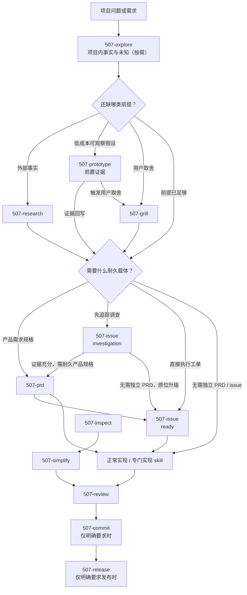

# code/ 代码工作流

代码工作流使用功能直译名称，让 skill（技能）的调用入口直接对应用户动作。每个 skill 都可独立触发；下面的完整链路只用于导航，不是强制流程。

## 工作流地图

```mermaid
flowchart TD
    problem["项目问题或需求"] --> explore["507-explore<br/>项目内事实与未知（按需）"]
    explore --> evidence{"还缺哪类前提？"}
    evidence -->|"外部事实"| research["507-research"]
    evidence -->|"低成本可观察假设"| prototype["507-prototype<br/>前置证据"]
    evidence -->|"用户取舍"| grill["507-grill"]
    evidence -->|"前提已足够"| ready{"需要什么耐久载体？"}
    research --> ready
    prototype -->|"证据回写"| ready
    prototype -->|"触发用户取舍"| grill
    grill --> ready

    ready -->|"产品需求规格"| prd["507-prd"]
    ready -->|"先追踪调查"| investigation["507-issue<br/>investigation"]
    ready -->|"直接执行工单"| issue["507-issue<br/>ready"]
    ready -->|"无需独立 PRD / issue"| implement["正常实现 / 专门实现 skill"]
    investigation -->|"证据充分，需耐久产品规格"| prd
    investigation -->|"无需独立 PRD，原位升级"| issue
    prd --> issue
    prd --> implement
    issue --> implement

    implement --> review["507-review"]
    review --> commit["507-commit<br/>仅明确要求时"]
    commit --> release["507-release<br/>仅明确要求发布时"]

    inspect["507-inspect"] --> simplify["507-simplify"] --> review
```

`507-handoff`（会话移交）位于 [`common/`](../common/README.md)，任何阶段需要中断、换会话、压缩上下文或转交时都可使用。

## 具体改动的证据、设计与验收

这些方法按当前缺口使用，不构成新的必经技能链：影响尚不清楚时，explore 用[代码影响调查](../common/507-explore/references/code-impact.md)核实不同入口、状态和恢复路径；需求已经明确时，正常实施可直接使用[代码改动设计](../common/507-grill/references/code-change-design.md)，明确谁接受写入、哪些已有路径可以复用、必须遵守什么契约、事件顺序与验证方法，不先开启一轮 grill。写 PRD 时按需使用[行为验收](507-prd/references/behavior-acceptance.md)保留代表性场景与证据要求。

只复用目标项目实际存在的检查；纳管范围、差异基准、已有与新增违规、例外和未覆盖部分分别报告。没有检查器时说明验证边界，不复制外部项目工具链，也不以刷新基线让检查通过。最终由 review 对照实际交付核验，结构检查不替代行为证据。

## 通用探索与项目初始化

### `507-explore` 项目探索（common）

项目问题尚未看清时的只读起手式。先读文档和代码依据，在会话中区分已知、未知、`frontier（当前可推进边界）`与证据边界，再路由到概念解释、外部调研、用户决策、原型、规格或实施。

触发：探索项目、定位代码、先看懂、先讨论、不知道从哪里开始，以及具体代码行为改动的影响尚不清楚。

### `507-setup` 项目初始化、规范迁移与巡检

按[项目启动与迁移标准](507-setup/references/project-standard.md)建立或检查目标、完整用户路径、共同语言、共用设计、现行规格、长期依据和工程前提。新项目直接采用，已有项目核对有效内容后迁移到同一职责与入口，同步引用并退出旧维护路径；完整／精简合同与受保护范围按真实风险选择。检查结果、迁移完成与下一步开工条件分别报告，缺少必要检查时交给正常工程建设，不用规范文字冒充保障。

全局 AGENTS 仅在明确目标位置后处理。只读请求报告缺口，已授权的初始化或迁移连续完成范围内工作；setup 整理协作与基础规范，map 维护导航，prd 维护具体规格，产品取舍交 grill，工程实现另由相应动作承接。普通局部任务不自动变成全项目迁移。

只维护某个目录的 README、doc 组织或项目地图时，不跑全量检查，使用 `507-map`。

## 前置证据、需求与任务

### `507-prototype` 前置原型验证

当一个具体未知可以由低成本、可丢弃原型直接观察，且学习收益高于制作与清理成本时使用。结论以证据记录和 verdict（结论）回到 explore、grill、PRD 或 issue；正式实现本身更小或原型不会改变决定时跳过。

### `507-taste` 视觉方向收敛

当目标是「做得对味」而不是「做得对」时使用。视觉决策没有可自动判定的成功条件，判据在用户脑子里，因此不做一步到位的生成，而是：先取只有用户才有的观点（性格、为谁、冻结哪一秒），一次铺开结构差异极大的粗稿，靠「留两个、弃一个」淘汰收敛；方向确认后才拆元素层、做组合台、跑可机械判定的检查。已有明确方向只差实现时跳过；只需回答一个具体未知用 `507-prototype`。

### `507-prd` 产品需求文档

将已确认需求整理为持续维护的行为与验收基准，回答解决什么问题、给谁、怎样表现及如何验收。优先更新 spec；旧版本方案或混合文档中的有效要求按授权迁移，版本交付安排留在 doc 并回链规格。按项目入口读取术语、共用设计与决策，区分目标、实现和验证。小改可以直接更新现行规格，不强制完整 PRD 或工单；恢复既定行为和不改含义的文字／格式调整无需机械新增规格。测试接缝由 agent 收口，跨入口或状态变化按需选择代表性场景，只有产品取舍缺口才返回 grill。

### `507-issue` GitHub Issue

同一 issue 支持 `draft → investigation → ready` 生命周期：调查态先承载问题、未知和证据动作，通过评论保留调查与决定变化历史并持续更新正文；事实与决策充分后原位升级为 ready，才成为可直接领取的执行合同。已有 PRD / 实施方案时，issue 只保留领取摘要并回链唯一完整规格。每个远程状态都按仓库规范设置并核验标签与负责人。

## 专门实现任务

### `507-fix` 根因修复

用于已明确的 bug、报错、崩溃、行为回归或合并冲突。先把故障复现为可重复检查的失败信号，再做最小根因修复并运行相关回归。

### `507-test` 测试与失败定位

测试本身是主任务时使用：补行为测试、运行测试、修正过时测试、分类和缩小失败范围。真实生产 bug 转 `507-fix`。

### `507-tdd` 测试驱动开发

仅在用户明确要求 TDD（测试驱动开发）、test-first（测试先行）、先写测试或红绿重构时使用。按垂直切片逐个完成 RED → GREEN → REFACTOR。

### `507-simplify` 行为不变简化

在公开 API（接口）、契约和调用者可观察行为不变的前提下，简化内部模块、抽象与接缝。可直接处理指定范围，也接收 `507-inspect` 的完整报告；每项先记录改动前的行为和验证方法；证据支持候选且能验证时才修改，否则说明证据并关闭该候选。

需要改变产品行为或公开契约时退出 `507-simplify`，回到需求与正常实现流程。

## 文档、审查、提交与发布

### `507-map` 项目地图

依据实现和已确认文档维护根／分层 README、spec／doc 导航，区分定位、共用规则、现行要求、实现与证据。授权迁移中等目标正文核验后切换地图、退出旧现行入口，报告未同步消费者；只修改地图，不接管业务代码、设计、术语、规格、决策、路线图或变更日志。

### `507-review` 交付审查

对任意明确变更范围统一检查 Standards（项目规范）、Spec（需求符合度）和 Code Quality（代码质量）。工作区干净时仍可审查分支、提交或路径；有状态或跨模块改动同时核对所有权、提交路径、时序和项目已有检查的真实覆盖；只报告发现和路由，不直接修。

### `507-commit` Git 提交

用户明确要求 commit（提交）时，轻量复核差异、同步必要产物、运行验证、精确暂存并创建真实本地 Conventional Commit（约定式提交）。只做本地提交，不重复完整 `507-review`；推送与对外发布交给 `507-release`。

### `507-release` 对外发布

用户明确要求推送、打标签或发布时使用。按本次授权选择仅推送、仅创建标签、版本定版发布或发布已有版本；仅推送不要求制造新版本与发版日志，定版发布仍核对日志、版本、标签和提交的一致性。范围不变时不逐步重复确认；commit 负责普通本地提交，release 处理已点名的标签、远端与发布渠道动作。

## 架构审查回路

### `507-inspect` 架构审查

只读寻找浅模块、职责泄漏、假设接缝、难测接口和局部性问题。每张候选卡必须提供代码观察证据、置信等级、必须保持的公开行为、设计约束，以及仍需取得的验证证据。

`507-inspect` 不修改代码；完整报告交给 `507-simplify`。后者为每项建立第二层证据门，结论可以是“修改并通过”“带证据关闭”或“需要行为变化，转需求实施”。

## 通用支撑

- `507-grill`：只有产品意图、权责边界、不可逆成本或风险取舍需要用户决定时，进行决策树对齐。
- `507-research`：核实外部事实与机制，产出可交给探索、原型、对齐或规格使用的证据包。
- `507-explore`：只读梳理项目内的已知、未知、`frontier（当前可推进边界）`与证据边界。
- `507-explain`：把单个陌生概念讲懂，不替代项目探索。
- `507-handoff`：中断、换会话、压缩上下文或转交时在对话中输出临时状态，不写文件。

## 路由判断

| 任务信号 | 使用 |
| --- | --- |
| 先定位、探索、讨论项目问题 | `507-explore` |
| 讲懂一个陌生概念或术语 | `507-explain` |
| 外部事实、机制或参考实现需要核实 | `507-research` |
| 一个具体未知值得用低成本原型验证 | `507-prototype` |
| 视觉方向没定，反复「不对味」 | `507-taste` |
| 形成具体产品需求规格 | `507-prd` |
| 草拟、调查、升级或创建 GitHub issue | `507-issue` |
| 初始化、存量规范迁移或全量巡检 | `507-setup` |
| README/doc/目录地图失真 | `507-map` |
| 已知 bug、报错或冲突 | `507-fix` |
| 测试是主任务 | `507-test` |
| 明确要求 test-first/TDD | `507-tdd` |
| 行为不变的内部简化或重构 | `507-simplify` |
| 主动寻找架构加深机会 | `507-inspect` |
| 审查某段明确交付 | `507-review` |
| 明确要求创建 Git 提交 | `507-commit` |
| 明确要求推送、发布或发版 | `507-release` |
| 中断、换会话、压缩上下文或转交 | `507-handoff` |

## 纪律

- 一 skill 一动作；相邻能力靠明确产物和路由接力。
- 每个 skill 可独立触发，不强制走完整链路。
- 每个 skill 声明完成信号、产物、候选出口与回退条件；出口可以有多个，也可以返回调用它的原工作流或直接结束。
- Agent 根据当前目标和证据选择下一 skill，并向用户简短解释理由；不把 skill 名称当成用户选择题。
- shared skill（共享技能）只定义结果、边界、产物和验收，不写宿主专属调度。
- 正常功能实现不强行包装成专门 skill；按需求、项目规范和宿主能力持续做到验证完成。
- 实现后按需校准项目地图，再独立审查；只有用户明确要求时才创建提交。
