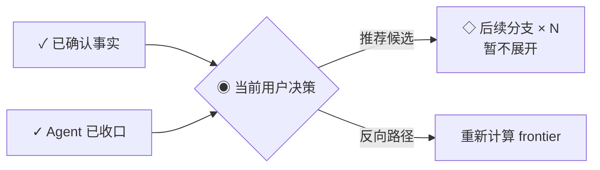

# 决策树追问（grill）

在真正动手改代码之前，用一轮结构化追问把计划问透：先与用户框定要解决的顶层分支，再在范围内按 **frontier（当前可问边界）** 推进——即所有前置条件已确定、可立刻询问的用户决策；其中互不影响的决策可由合适工具批量收集，没有合适工具时逐题问到底。每轮回答后重新计算 frontier；每走完一个分支收束固化一次，走完即结束。对齐过程中确定的术语当场沉淀进 `doc/术语表.md`（术语表），够格的决策记入 `doc/决策档案/`（架构决策记录）。

解决的核心问题是 **misalignment（对齐失败）**——agent 以为懂了，做出来才发现理解错了。先追问，再动手。

## 覆盖什么

- 一个具体改动 / 功能 / 方案实施前的对齐
- 把模糊需求追问成精确的决策
- 在提问前读取代码、运行既有测试或做最小只读/可丢弃验证，先把可查事实查清
- 顺便沉淀项目术语表和关键决策

## 不覆盖什么

- 通过开放式采访显化作者尚未表达的亲历、判断与边界 → 交给 `507-prospect`；它不提供候选或推荐，以免锚定作者材料
- 结构化方案 / 计划文档起草 → 不在本 skill 范围
- 代码实现本身（对齐完交给正常开发流程）
- 不把 agent 应自行完成的设计、API（接口）细节、内部模块划分、参数命名、测试清单或工程验证方案交给用户决策；这些是对齐结论后的 agent 设计责任。

> 两者递进：`507-grill`（轻量对齐，分钟级）→ 落成方案文档（另一件事）。

## 核心纪律（不可违反）

1. **按 frontier 推进依赖层**：先识别当前 frontier（所有前置条件已确定、可立即询问的用户决策）。若其中只有一个问题，或没有合适的收集工具，一次只问一个问题，等用户回答后重新计算；若有合适工具，则将当前已知、彼此答案不会改变对方是否出现、题意或候选项的决策批量收集。绝不将依赖未决答案或未核实事实的问题提前混入。
2. **需要用户决策时，给出 2–5 个真实候选并标出推荐项**。每项用一行写清“适合什么 + 代价什么”；推荐项是其中一个候选，不是唯一视角。
3. **候选必须对抗性成立**：它们必须代表不同策略、优先级或权衡，至少主动检查一个能挑战推荐项的反向路径。不要从同一个推荐答案衍生轻微变体凑数；如果理性的协作者在不同优先级下不会真选某项，就删掉它。已被既有决策、代码事实或项目边界排除的路径不是候选——说明为何排除即可，不得为凑数重提。应主动检查“暂不做 / 延后验证”，但只有它确实合理时才列入。
4. **先过事实与决策所有权闸门，再问用户**：能通过代码、文档、既有共识、工程常识、运行既有测试或小型验证自行确定的，先验证并把证据带回对话，不把可查事实改写成用户选择题。环境事实未决时，只冻结依赖它的问题，其余 frontier 照常推进。API schema（模式）、参数命名、单次上限、模块边界、兼容策略、状态细节、测试接缝与工程验证默认由 agent 收口；只有会改变产品意图、权责边界、不可逆成本、体验取舍或风险承受的选择，才交给用户。若只有一个合理结论，直接说明判断并执行，不伪造候选。
5. **纠错先于追问**：发现概念混淆、重复已排除路径或将工程细节转交给用户时，立即停止当前决策树；重述已确认边界，撤回错误候选或未落地文档，自行收口受影响的工程设计。不得把修正自身理解变成新的用户选择题。
6. **有界决策树（总上限）**：追问开始前，先与用户框定本次对齐要解决的**顶层分支**（粗框、有边界即可）；后续追问在这个范围内走，每个分支沿依赖关系一个接一个问到底，不中途跳过；所有顶层分支走完即结束，这是整个对齐的总上限，不靠用户叫停。
7. **阶段性收束（过程上限 + 固化记忆）**：每走完一个顶层分支，强制收束一次——在对话里输出一块累积共识（见输出格式），把截至当前所有已确认分支的结论固化下来。这既是过程上限（单分支走完即固化、不无限下钻），也解决长对话的记忆衰减：共识不靠对话流记忆，靠这块最新、最全的锚点。
8. **显式扩范围**：追问中发现顶层分支范围外的相关问题，先停下来跟用户确认要不要纳入；纳入则更新范围清单继续走；不纳入则记成观察项留到对齐总结里，本次不展开。不偷偷扩成无限追问。
9. **复杂时才显示决策控制台**：简单单题沿用普通追问，少量并列信息使用 Markdown 表格或列表；只有事实、Agent 收口、用户决策、依赖或冲突之间的关系已难用线性文字一眼看清时，才输出 `Mermaid（图表语法）` 控制台。不要生成 ASCII 图，也不要同时输出图表与等价字符图；Mermaid 无法渲染时退回结构化文字或表格。
10. **新结论先过冲突闸门**：在确认或沉淀新结论前，先核对相关术语、当前规格、issue 和 ADR。事实冲突由 agent 核验；agent 判断违背已确认用户决定时由 agent 纠正；只有用户的新选择会取代既有用户决定时，才把冲突提升为当前 frontier。
11. **决策进入最近的当前权威**：不建立通用 `decisions.md` 或第二状态源。只影响当前会话的结论留在累积共识；需要跨会话继续生效的决定进入它实际约束的当前规格、PRD、issue 或项目文档，只有满足门槛时才进入术语表、ADR 或经验笔记。

## 输出格式

三种必需输出对应三个阶段：开始前框定范围、过程中按分支收束、全部走完做总结。复杂对齐可在追问前插入决策控制台；它是会话级视觉摘要，不是第四种持久产物。

### 框定范围（追问开始前）

```md
## 本次对齐范围

顶层分支：
1. <分支一>
2. <分支二>
...

请确认，或增删。
```

### 决策控制台（复杂对齐时按需）

控制台只帮助用户看懂“哪些已经确定、现在只需决定什么、答案会解锁多少后续分支”，不保存项目状态。Mermaid 表达状态与关系；当前候选仍通过图下的文字、表格或宿主交互控件呈现，图不能成为唯一信息源。

满足任一条件时才考虑显示：

- 当前同时存在事实、Agent 收口与用户决策等多种归属，线性叙述容易混淆；
- 当前 frontier 有多道独立决策，或一个答案会解锁多个分支；
- 新判断与既有术语、决策或用户意图发生冲突；
- 三个以上节点存在真实分叉、汇合或依赖，图比短段落明显更容易理解。

显示规则：

- 决策依赖、分叉、汇合和冲突默认使用 `flowchart`。只有被对齐对象本身更适合其它关系模型时，才从当前渲染器支持的五类中选择：

| 需要表达的关系 | Mermaid 类型 |
|---|---|
| 决策依赖、分叉、汇合、冲突 | `graph` / `flowchart` |
| 生命周期或状态转换 | `stateDiagram` / `stateDiagram-v2` |
| 类型、职责或领域模型 | `classDiagram` |
| 数据实体及基数关系 | `erDiagram` |
| 参与方交互与先后顺序 | `sequenceDiagram` |

- 不使用当前渲染器不识别的 `gantt`、`pie`、`gitGraph`、`mindmap`、`timeline`、`journey` 或其它 Mermaid 类型；需要这些表达时改用受支持的 `flowchart`，或退回 Markdown 表格/列表。
- 使用保守、清晰的核心语法。若渲染器给出 warning 或无法识别，先简化为同类支持语法；仍失败则使用结构化文字，不改画 ASCII 图。
- 图前先用一句话说清当前状态，图后紧接当前可回答的候选项或交互控件；不把候选细节塞满节点。
- 固定状态为 `✓ 已确认`、`◉ 当前 frontier`、`◇ 被阻塞`、`✕ 已排除 / 冲突`。不要新增任务执行状态，把控制台扩成项目看板。
- 被阻塞问题只显示数量或已确认的顶层分支名；不得提前展示其具体题意、候选或推测答案。
- 当前只有一道用户决策时不编号；当前 frontier 有多道独立问题，或需要交给跨会话载体时，才使用稳定问题 ID。
- 一个分支走完后，把结果折叠进累积共识并按当前 frontier 重绘；不保留已经过期的过程图。

默认决策控制台使用 `flowchart`：



### 追问（一个依赖层）

> 只在通过“决策所有权闸门”后使用本模板。若当前依赖层有多道已知且互不影响的问题，并且有合适的收集工具，可一次批量收集；否则用本模板一次只问一个问题。不要把 API（接口）字段、内部实现、测试路径、验证动作或已被排除的选项写进候选。决策控制台只表达关系；当前候选始终用本模板或宿主等价的可操作控件呈现。

```md
## 问题 N
<一个只有用户能决定的具体问题>

1. <候选一> —— <适合什么 + 代价什么>
2. <候选二> —— <适合什么 + 代价什么>
3. <候选三（若真实存在）> —— <适合什么 + 代价什么>

**我的推荐：** 选项 N；<一句判断和理由>。

**为什么现在问：** <这个问题会影响哪些后续分支>
```

### 收束（每走完一个顶层分支）

在对话里重写整块累积共识——按分支分组、带序号，让这块永远是最新、最全、最靠前的锚点，旧上下文被稀释也不影响。若此前显示过决策控制台，把已完成分支折叠进这里，随后只按新 frontier 重绘，不保留旧图：

```md
## 当前共识（截至分支 K 完成）

### 分支 1：<分支名>
- <结论一>
- <结论二>

### 分支 2：<分支名>
- <结论一>

### 分支 K：<分支名>（本次新增）
- <结论一>
```

### 对齐总结（所有顶层分支走完）

一句话：已确认什么、有哪些观察项、建议下一步进入哪个工作流（直接实现 / 落成方案文档 / 备查 等）。

若用户只要求对齐、尚未明确授权实施，则在总结后先请其确认“共同理解已成立”，再动手；若原始请求已明确“对齐后直接实施”，无需重复设确认关口。

## 决策冲突闸门

每次确认新结论前，先读取与当前分支直接相关的现行术语、规格、issue 正文和 ADR；不要为了形式完整通读全部历史。发现冲突时按归属处理：

| 冲突类型 | 处理 |
|---|---|
| 新事实与旧说法冲突 | agent 通过代码、测试或证据核验并纠正事实，不询问用户选择事实 |
| agent 当前判断与已确认用户决定冲突 | agent 撤回或调整自己的判断，除非新证据会改变产品边界或风险取舍 |
| 用户的新选择与既有用户决定冲突 | 决策控制台同时显示旧结论、新选择、影响与推荐，把“当前以哪个为准”作为唯一 frontier |
| 新选择与 ADR 冲突 | 先确认是否真的改变原决定；确认后保留旧 ADR，新 ADR 写明取代关系并更新索引 |
| 当前权威彼此冲突 | 不静默选边；先按文档职责和现场证据识别过期项，仍涉及用户取舍时再进入 frontier |

冲突解决后，当前规格或 issue 正文只保留最新真相；旧选择与取代原因进入 issue 评论、Git 历史或新 ADR，不在两个当前权威中并行维护。

## 对齐时同步做的四件事

边追问边做，不是独立步骤：

- **挑战术语冲突**：用户用的词若和 `doc/术语表.md` 现有定义冲突，当场指出——"术语表里 X 定义是 A，但你这里像在说 B，是哪个？"
- **锐化模糊语言**：遇到模糊或过载的词，提出精确的规范术语——"你说的是'账户'，指 Customer（客户）还是 User（用户）？这俩是不同东西。"
- **造具体场景压测**：讨论概念关系时，编造压测边界的场景，促使用户精确界定概念边界。
- **对照代码验证**：用户描述某处怎么工作时，去代码里核对；发现矛盾就挑明——"代码里是整单取消，但你刚说支持部分取消，哪个对？"

## 边对齐边沉淀

对齐过程产出的东西先判断是否需要跨会话继续约束未来工作。**会话级共识**活在对话里的累积共识块，对齐结束即可清理；需要耐久保存时进入它实际约束的最近权威，不建立汇总所有决定的通用日志。

### 决策归宿

| 结论类型 | 唯一主出口 |
|---|---|
| 只影响本次对齐或马上执行的局部选择 | 会话累积共识 |
| 已确认、需要成为耐久产品与验收基准的需求 | 项目既有规格入口；无既有约定时由 `507-prd` 路由到 `doc/40-版本实施方案/` |
| 仍需跨会话调查、排期、执行或验收 | 当前 issue 正文；讨论与取代历史进评论 |
| 当前产品、架构、运行或 UI / UX 的稳定事实 | `doc/README.md` 指定的当前权威文档 |
| 项目特有概念“是什么” | `doc/术语表.md` |
| 同时满足“难逆转、无上下文会困惑、有真实权衡” | `doc/决策档案/` |
| 可修改、下次仍会复用的做法与避坑 | `doc/经验笔记.md` |

同一结论只保留一个正文权威；其它载体只摘要并回链。确定归宿不等于获得新的写入授权：当前请求已授权修改对应项目文档时可以当场更新；只授权对齐、或归宿属于 PRD / 远程 issue 等独立动作时，先把结论保留在累积共识并路由给对应 skill。没有耐久消费者、也不需要跨会话接力时，不为保存决定而强制创建 PRD、issue 或新目录。

### 术语 → `doc/术语表.md`

一个术语敲定就当场写进 `doc/术语表.md`，不攒着批量补。

**`doc/术语表.md` 是纯粹的术语表，不沾任何实现细节**——不是 spec（规格说明）、不是草稿本、不是决策仓库，只回答"这个项目里这个词精确指什么"。格式见附录。

### 决策 → `doc/决策档案/`

只有**同时满足三条**才记 ADR：
1. **难逆转**——事后改主意的成本很高。
2. **无上下文会让人困惑**——未来读者看到代码会问"为什么这么搞"。
3. **有真实权衡**——存在过真正的备选方案，你为特定理由选了这一个。

缺任何一条都不记。ADR 可以只有一段话，重点是"记录做了决定 + 为什么"，不是填模板。

新决定取代旧 ADR 时，不删除或重写旧文件来伪造历史；新增 ADR 并写明“取代 000X”，旧 ADR 和索引同步标明已被取代。

### 做法 → `doc/经验笔记.md`

收"可改的做法与避坑经验"，回答"这事儿怎么做"。与术语表、决策档案按边界分工，不混用。

**准入门槛**：解决一个坑时，如果换一个无上下文的 agent 来会重走一遍，就值得记。不满足 ADR 三条（所以进不了决策档案）、也不是词的定义（所以进不了术语表），但下次还会用到的经验走这里。

**条目格式**：现象 + 做法 + 证据（日志路径 / commit / ADR 指向）。写不出证据 = 还没到值得记的程度。

**维护方式**：重复发生时在原条目追加证据，不新建条目。做法被推翻就改这条，不删（保留演进痕迹）。

## 文档结构约定

遵循项目既有目录，**不另起 `CONTEXT.md`**：

- 术语表：`doc/术语表.md`（单文件，大多数项目够用）
- 决策记录：`doc/决策档案/0001-中文标题.md`（顺序编号，标题用中文，项目术语沿用术语表规范叫法）；新增 / 更新 ADR 时同步 `doc/决策档案/README.md` 索引（编号 + 标题 + 一句话主旨）
- 经验笔记：`doc/经验笔记.md`（单文件，条目用 markdown 列表）
- 惰性创建：没有 `doc/术语表.md` 就不建，第一个术语敲定时再建；`doc/决策档案/`、`doc/经验笔记.md` 同理。

## 启动姿势

当用户说"先对齐一下 / 追问一下 / grill"时：

1. 先理解这次要做什么改动。
2. 按 AGENTS.md 文档优先级读 `doc/`，掌握现有术语和已记录决策。
3. **框定顶层分支**：列出本次对齐要解决的顶层分支，请用户确认范围（这是总上限的依据）。
4. 每次提问前先过“事实与决策所有权闸门”：能读代码、跑测试或做最小验证查清的事实先自行查；能由 agent 收口的工程细节立即自行设计；只有用户意图 / 边界 / 风险取舍进入问题列表。
5. 对当前候选结论执行“决策冲突闸门”：事实和 agent 判断自行纠正；只有新旧用户决定真正冲突时才进入 frontier，不静默覆盖。
6. 在范围内按 frontier 追问，一个分支一个分支走：每轮仅收集前置条件已确定的独立决策；有合适工具时批量收集，否则一次只问一个问题；复杂关系满足条件时先显示决策控制台；每轮回答后重新计算 frontier；每走完一个顶层分支，输出一块累积共识。
7. 每敲定一个结论，先确定唯一决策归宿；当前授权包含对应写入时才更新，否则把可接力结论交给 `507-prd`、`507-issue` 或项目文档维护入口。术语、ADR 与经验笔记仍遵守各自准入门槛和当前写入范围。
8. 所有顶层分支走完，agent 自行补全 API、实现切片和验证方案；给用户一句话总结对齐结果。仅当用户未在原始请求中明确授权实施时，再请其确认共同理解后进入实现或交接。

## 完成与接力

- **完成信号**：顶层分支已走完；可查事实有证据，用户拥有的决策已确认，工程细节由 agent 收口；新旧结论冲突已经处理，最新共识块和耐久权威没有并存的相反结论。
- **产物**：会话中的累积共识，复杂时可包含随 frontier 重绘的临时决策控制台；需要耐久保存且当前已授权时更新对应权威，否则产出带明确归宿的可接力结论。
- **候选出口**：面向人的活动、培训、合作或项目方案进入 `507-frame`；具体产品需求需要耐久规格时进入 `507-prd`；需要追踪调查或执行时进入 `507-issue`；需要低成本观察后再定时进入 `507-prototype`；前提充分且已授权时直接实施；只需对齐时直接结束。
- **回退条件**：发现项目事实仍不清楚时转 `507-explore`、`507-research` 或 `507-prototype`，带回证据后继续当前决策树。

---

## 附录：术语表格式（`doc/术语表.md`）

```md
# {项目名} 术语表

{一两句话说明这是什么项目。}

## Language

**Order（订单）**：
客户发起的一次购买请求。
_Avoid_: Purchase、transaction

**Customer（客户）**：
下单的人或组织。
_Avoid_: Client、buyer、account
```

规则：
- 定义"它是什么"，不是"它做什么"，一到两句。
- 有同义词时挑最好的做主词，其余列入 `_Avoid_`（禁用词）。
- 只收项目特有概念；通用编程概念（timeout、错误类型、工具模式）即使大量使用也不收。

## 附录：ADR 格式（`doc/决策档案/`）

```md
# {决策的短标题}

{1-3 句：背景是什么、决定了什么、为什么。}
```

就这样，可以只有一段。仅在"记录做了决定 + 为什么"有价值时才写。可选段落（Status / Considered Options / Consequences）只在确实有内容时加。文件名顺序编号：扫 `doc/决策档案/` 取最大号 +1。
