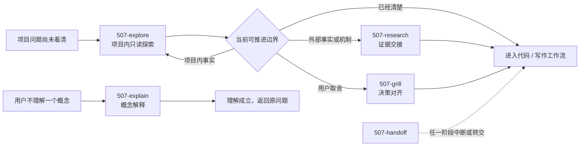

# common/ 通用认知与协作技能

这里放不依赖具体交付类型、可同时服务代码与写作工作流的能力。它们处理“还没看清”“没听懂”“需要外部证据”“需要用户决定”和“需要转交”，不接管 `code/` / `write/` 内部的实施与创作动作。

## 工作流

流程图是导航，不是强制仪式。任务已经清楚时可以直接进入对应技能。

## 每个技能的职责

### `507-explore` 项目探索

读取项目规则、既有共识与现实证据，在临时会话中累积呈现目标、已知、未知、`frontier（当前可推进边界）`与证据边界。只读，不建立持久探索地图；找到下一项明确动作后停止并路由。

### `507-explain` 概念解释

把用户不理解的一个概念讲懂。先给最短白话定义，再按需使用例子、反例、对比、表格、`Mermaid（图表语法）`或 `ASCII（字符图）`示意；默认不落盘，不定位项目未知。

### `507-research` 外部调研

核实外部项目、文章、标准、竞品或当前事实，区分事实、来源观点、本项目推断与未知，默认在对话中产出可追溯的证据交接。需要判断对当前项目的借鉴时，再做“设计冲突 / 同思路 / 候选”三档判断；只有结论需要长期复用时才落参考文档。

### `507-grill` 决策树追问

在事实前提已足够时，沿依赖关系逐步对齐只有用户能够决定的产品意图、权责边界、不可逆成本、体验与风险取舍，并按项目规则沉淀够格的术语、决策和经验。

### `507-handoff` 会话移交

中断、换会话、压缩上下文或转交时，在对话中输出脱敏的临时交接摘要；只引用正式产物，不建立第二事实源。

## 边界速查

| 用户真正需要什么 | 使用 |
|---|---|
| 项目里知道什么、还不知道什么、下一步先查什么 | `507-explore` |
| 一个概念是什么意思、如何形成正确心智模型 | `507-explain` |
| 外部事实或机制能确认什么，证据在哪里 | `507-research` |
| 已知前提下的用户取舍最终选什么 | `507-grill` |
| 把尚未沉淀的运行状态交给下一会话 | `507-handoff` |

这些技能是横向支撑层；长期事实仍进入项目既有文档、规格、工单或写作资产。
