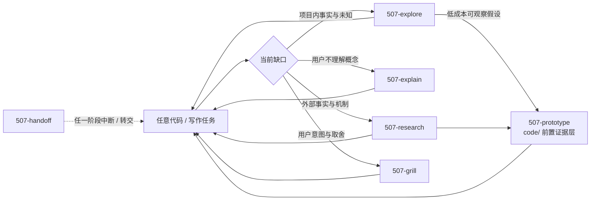

# common/ 横向认知与协作层

`common/` 放不依赖具体交付类型、可同时服务代码与写作的能力。它不是“先 common、再 code/write”的固定前置阶段，而是任意工作流在遇到项目未知、概念障碍、外部证据、用户决策或会话转交时调用的横向层。

任务已经清楚时可以直接进入 `code/` 或 `write/`；横向问题解决后，应返回原任务或进入边界最清楚的下一动作。

## 横向关系

## 五个动作

### `507-explore` 项目探索

读取项目规则、既有共识与现实证据，在临时会话中累积重写目标、已知、未知、当前可推进边界和证据范围。只读，不建立持久探索地图；问题已回答或找到专门动作后停止。

### `507-explain` 概念解释

把用户不理解的一个内部或外部概念讲懂。先给最短白话定义，再按需要使用例子、反例、对比、表格、Mermaid 或 ASCII；默认不落盘，不替代项目探索和外部查证。

### `507-research` 外部调研

核实外部项目、文章、标准、竞品或时效事实，区分事实、来源观点、本项目推断与未知，默认在对话中产出可追溯的 evidence handoff（证据交接）。只有结论需要长期复用时才落项目既有参考目录。

### `507-grill` 决策对齐

在提问前先读取代码、运行既有测试或做最小验证，把可查事实查清；随后沿依赖关系只询问用户拥有的产品意图、权责边界、体验、成本和风险取舍。确认内容按门槛进入术语表、决策档案或经验笔记。

### `507-handoff` 会话移交

中断、换会话、压缩上下文或转交时，在对话中输出脱敏临时摘要。它引用正式产物，不建立第二事实源。

## 边界速查

| 当前真正缺什么 | 使用 | 典型返回 |
| --- | --- | --- |
| 项目里知道什么、还不知道什么、下一步先查什么 | `507-explore` | 原任务、research、prototype、grill 或交付 |
| 一个概念是什么意思、怎样建立正确心智模型 | `507-explain` | 原任务 |
| 外部事实或机制能确认什么、证据在哪里 | `507-research` | explain、explore、mine、grill、规格或交付 |
| 已知前提下的用户取舍最终选什么 | `507-grill` | frame、prd、issue、prototype、写作或实施 |
| 把尚未沉淀的运行状态交给下一会话 | `507-handoff` | 下一会话对应动作 |

## 出口纪律

- 每个 skill 可有多个候选出口，也可直接结束或返回调用它的原工作流。
- Agent 根据当前目标、证据和各 skill 的出口合同选择下一步，并简短说明理由。
- 用户只回答其真正拥有的意图与取舍，不负责记忆或选择 skill 名称。
- 长期事实仍进入项目既有术语表、决策档案、经验笔记、规格、工单或写作资产；横向层不新建总控状态库。
