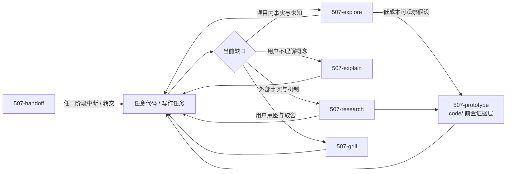

# common/ 横向认知与协作层

`common/` 放不依赖具体交付类型、可同时服务代码与写作的能力。它不是“先 common、再 code/write”的固定前置阶段，而是任意工作流在遇到项目未知、概念障碍、外部证据、用户决策或会话转交时调用的横向层。

任务已经清楚时可以直接进入 `code/` 或 `write/`；横向问题解决后，应返回原任务或进入边界最清楚的下一动作。

## 横向关系

```mermaid
flowchart LR
    task["任意代码 / 写作任务"] --> need{"当前缺口"}
    need -->|"项目内事实与未知"| explore["507-explore"]
    need -->|"用户不理解概念"| explain["507-explain"]
    need -->|"外部事实与机制"| research["507-research"]
    need -->|"用户意图与取舍"| grill["507-grill"]

    explore --> task
    explain --> task
    research --> task
    grill --> task
    handoff["507-handoff"] -. "任一阶段中断 / 转交" .-> task

    explore -->|"低成本可观察假设"| prototype["507-prototype<br/>code/ 前置证据层"]
    research --> prototype
    prototype --> task
```

## 五个动作

### `507-explore` 项目探索

读取项目规则、既有共识与现实证据，在临时会话中累积重写目标、已知、未知、当前可推进边界和证据范围；多条技术路径尚无法判断时，形成带依据、风险和最小验证动作的候选。只读，不建立持久探索地图；具体代码行为的影响不明时，按需使用[代码影响调查](507-explore/references/code-impact.md)逐入口追踪校验、提交、状态与恢复；问题已回答或找到专门动作后停止。

### `507-explain` 概念解释

把用户不理解的一个内部或外部概念讲懂。最短定义里的名词必须可指认，零直觉时先给具体场景再提炼定义；引入的未解释术语必须现在讲、标为黑盒或删掉重写，不留隐藏术语债务。解释未成立时按构造、表达、载体三层依次排查：先修定义落地与术语归宿，再改图设计或换真实运行证据，只有量级、连续变化或需亲手调整才有直觉的感知型障碍才在临时位置生成视觉件。示意使用表格或受支持的 Mermaid，无法渲染时退回结构化文字或表格，不生成 ASCII 图。默认不落盘，不替代项目探索和外部查证。

### `507-research` 外部调研

核实外部项目、文章、标准、竞品或时效事实，区分事实、来源观点、本项目推断与未知，默认在对话中产出可追溯的 evidence handoff（证据交接）。学习传播或增长内容时，还须交接标题点击理由、正文兑现及效果证据边界，创作与标题改编归 forge。只有结论需要长期复用时才落项目既有参考目录。

### `507-grill` 决策对齐

在提问前先读取代码、运行既有测试或做最小验证，把可查事实查清；随后沿依赖关系只询问用户拥有的产品意图、权责边界、体验、成本和风险取舍。复杂对齐按需显示 Mermaid 决策控制台，限用当前渲染器支持的 flowchart、state、class、ER 与 sequence 五类图；简单单题维持普通追问，少量并列信息使用文字或表格，不生成 ASCII 图。新结论先处理与当前权威的冲突，再进入它实际约束的规格、PRD、issue、术语表、决策档案或经验笔记，不建立第二决策库；耐久写入仍受当前授权约束。代码需求的[工程设计](507-grill/references/code-change-design.md)由 Agent 收口，已明确的正常实施可直接使用该参考，不必重开对齐。写作中若缺的是作者尚未表达的经历与已有判断，进入 [`507-prospect`](../write/507-prospect/SKILL.md) 做非诱导式创作采访；这不是决策对齐。

### `507-handoff` 会话移交

中断、换会话、压缩上下文或转交时，在对话中输出脱敏临时摘要。它引用正式产物，不建立第二事实源。

## 边界速查

| 当前真正缺什么 | 使用 | 典型返回 |
| --- | --- | --- |
| 项目里知道什么、还不知道什么、现在先查什么或验证哪个候选 | `507-explore` | 原任务、research、prototype、grill 或交付 |
| 一个概念是什么意思、怎样建立正确心智模型 | `507-explain` | 原任务 |
| 外部事实或机制能确认什么、证据在哪里 | `507-research` | explain、explore、mine、grill、规格或交付 |
| 作者如何叙述自己的亲历与判断，但尚未充分表达 | [`507-prospect`](../write/507-prospect/SKILL.md) | mine、返回调用它的创作动作或直接结束 |
| 已知前提下的用户取舍最终选什么 | `507-grill` | frame、prd、issue、prototype、写作或实施 |
| 把尚未沉淀的运行状态交给下一会话 | `507-handoff` | 下一会话对应动作 |

## 出口纪律

- 每个 skill 可有多个候选出口，也可直接结束或返回调用它的原工作流。
- Agent 根据当前目标、证据和各 skill 的出口合同选择下一步，并简短说明理由。
- 用户只回答其真正拥有的意图与取舍，不负责记忆或选择 skill 名称。
- 长期事实仍进入项目既有术语表、决策档案、经验笔记、规格、工单或写作资产；横向层不新建总控状态库。
