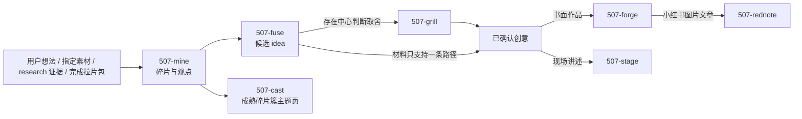
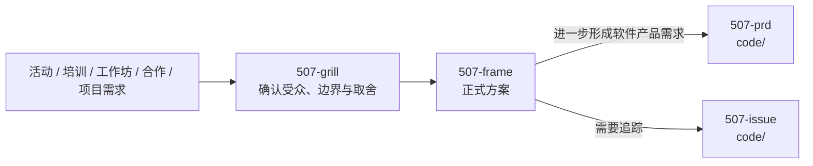
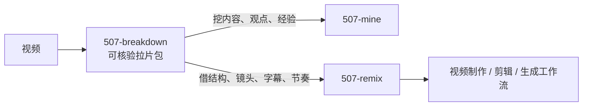

# write/ 写作与内容工作流

`write/` 处理碎片、选题、知识沉淀、书面作品、现场内容、人类方案、视频和平台适配。主创作链保留冶金隐喻；视频、舞台、方案与平台适配使用各自领域的动作名。

`common/` 是横向层：任何写作阶段遇到项目未知、概念障碍、外部证据或用户取舍，都可以调用 `explore`、`explain`、`research` 或 `grill`，解决后返回。它们不是写作前必须依次跑完的仪式。

## 三类入口

### 1. 素材、观点与知识



`research` 与 `mine` 不合并：research 负责把外部世界查清并交付证据；mine 负责把想法、素材或证据变成自己的可复用碎片。事实缺口可以 `mine → research → mine` 返回。

### 2. 面向人的方案



`frame` 服务“人如何理解、批准和行动”；具体软件产品应表现为什么行为、如何验收，归 `507-prd`。frame 不在写方案过程中重新承担用户决策确认，缺口返回 grill。

### 3. 视频



`breakdown` 负责取证；`mine` 消费内容；`remix` 消费创作手法。两条下游可同时存在，Agent 根据当前目标选择并说明理由。

## 冶金主链

```text
mine（挖掘） → fuse（融合） → forge（锻造）
素材变碎片       碎片变候选 idea   已确认创意变书面主稿
01-碎片/         02-创意/候选/     03-作品/

cast（铸造）与 fuse 平行：成熟碎片簇 → 04-知识库/主题页
```

- **mine** 不做系统外搜、不产选题、不写正文；
- **fuse** 比较竞争解释并产候选，不替用户拍板中心判断；
- **forge** 只在写作合同和证据承重成立后成文；
- **cast** 只聚合碎片链接与元信息，不把主题页写成长文。

## Skill 边界

### `507-mine` 碎片挖掘

输入是用户想法、指定素材、research 证据交接或 `video_completed` 拉片包；先查既有碎片/作品/知识库去重和互链，再产可复用碎片、观点与材料交接。跨来源核实、时效查证或反例搜索进入 research 后返回。

### `507-fuse` 候选融合

比较碎片背后的支持证据、反例、替代解释和边界，材料确有竞争路径时产 2～5 条候选 idea；材料只支持一条时说明收敛理由。用户拥有的中心判断选择通过 grill 完成，Agent 再按既有交付目标路由到 forge 或 stage。

### `507-cast` 知识铸造

把成熟碎片簇聚合成 `04-知识库/` 主题页，并同步知识图谱与索引。主题结构涉及用户知识组织取舍时通过 grill 确认；不够成熟时继续留在碎片图谱生长。

### `507-forge` 书面成文

把已确认创意、写作合同和承重证据统一写成可发布主稿。外部事实缺口进 research，碎片缺口进 mine，竞争解释进 fuse，中心判断取舍进 grill；完成后可直接结束或进入 rednote/stage。

### `507-stage` 现场讲述

把已确认的听众、场景、时长、目标和内容编排成演讲稿、PPT 逐页稿、课程或企业培训内容。每页只推进一个认知台阶；内容未收口时不进入视觉制作。

### `507-frame` 人类方案

消费 grill 已确认的需求与边界，写活动、培训、工作坊、合作提案或项目计划。写法、章节和呈现由 Agent 自主完成；用户意图缺口返回 grill，软件产品规格进入 PRD。

### `507-breakdown` 视频拉片

将一个视频经 MiniMax-M3 整段理解、本地文本定位、受限视觉搜索、自适应抽帧和图片证据回写，编译成 validator 通过的 `video_completed` 拉片包。时间窗只能由本地证据承重。

### `507-remix` 视频借鉴重组

只消费一个或多个完成拉片包，借结构、叙事、镜头、字幕和节奏模式，明确不借逐句内容、人物身份和品牌资产，输出人读创作包与工具无关 `prompt-pack.json`；不直接生成成片。

### `507-rednote` 小红书图片文章

把成熟书面主稿保真改编成逻辑 Copy Spec、自动分页 3:4 图卡、HTML、联系表和渲染清单。规格与渲染清单 SHA-256 必须一致，承重内容逐项映射；不负责账号登录和发布。

## 产物接力

| 上游产物 | 可被谁消费 | 说明 |
| --- | --- | --- |
| research 证据交接 | mine / forge / stage / grill | 外部事实与来源边界 |
| mine 碎片与材料交接 | fuse / cast | 观点、经验、问题和证据关系 |
| fuse 候选 idea | grill → forge / stage | 先确认中心判断，再按交付目标成文 |
| cast 主题页 | fuse / 直接查阅 | 知识入口，不是文章正文 |
| forge 书面主稿 | rednote / stage / 直接发布 | 唯一正文真相源 |
| breakdown 拉片包 | mine / remix | 内容与创作手法分流 |
| remix 创作包 | 视频执行工作流 | 蓝图，不是最终成片 |
| frame 正式方案 | PRD / issue / 人类决策 | 面向人的行动载体 |
| rednote 发布包 | 授权后的发布流程 | 图卡、HTML、联系表、清单 |

## 出口纪律

- 每个 skill 可独立触发，不强制走完整链路。
- 每个 skill 声明完成信号、产物、候选出口与回退条件；出口可以有多个。
- Agent 根据用户已表达的目标选择下一 skill 并说明理由，不让用户选择 `forge / stage / frame / remix` 等内部名称。
- 真正属于用户的内容判断、方案边界和发布承诺统一进入 `507-grill`；工程、格式、测试与渲染细节由 Agent 自主完成并告知用户。
- 共享知识库目录与流水线纪律以目标 vault（知识库）的 `AGENTS.md` 和 README 为准。
