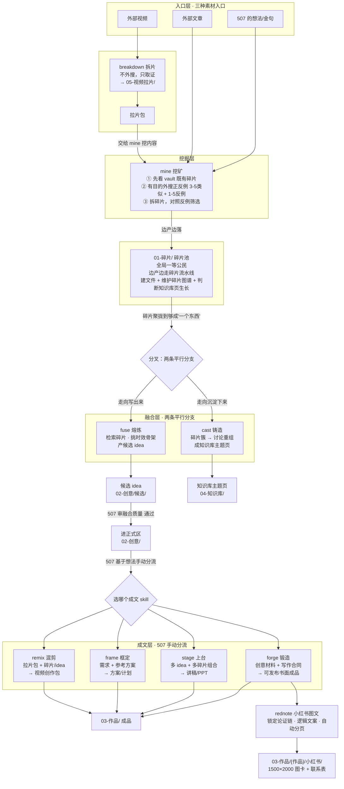

# write/ 写作工作流

507 的写作工作流，从素材到成品的完整链路。按**冶金隐喻**命名——把内容生产类比为金属加工工序。

## 冶金隐喻命名体系

写作流的主链用**冶金工序**命名，因为内容生产和冶金是同构的：

```
mine（挖矿）  →  fuse（熔炼）  →  forge（锻造）
挖原矿碎片      碎片熔成候选 idea   共创为书面成品
   ↓               ↓                  ↓
01-碎片/        02-创意/候选/       03-作品/
```

- **mine 挖矿**：从素材（想法/文章/视频）里挖出原矿碎片——零散的判断、金句、场景
- **fuse 熔炼**：把碎片熔在一起，提纯出候选 idea——哪些碎片能成一个选题的骨架
- **forge 锻造**：把 idea 与创作材料锻造成可发布书面成品——先立写作合同，再整篇成稿与统一重写

平行的沉淀支线延续冶金隐喻：

- **cast 铸造**：把碎片簇浇铸成定型的知识库主题页（和 fuse 平行，fuse 走向"写出来"，cast 走向"沉淀下来"）

视频支线和成文层变体用各自领域的动作隐喻（不和冶金链强行统一，因为材质不同）：

- **breakdown 拆片** + **remix 混剪**：影视工序（拆解视频 + 重组二创）
- **stage 上台**：舞台工序（内容搬上舞台讲出去）
- **frame 框定**：建筑工序（把需求框成结构化方案）
- **rednote 小红书图文**：发布适配工序（把成熟书面作品变成 3:4 图片文章）

## 每个 skill 的介绍

### 入口/挖掘层

#### `507-mine` 挖矿
写作流的最上游。吃三种素材——507 自己的想法、外部文章、视频拉片内容——先看 vault 既有碎片做有目的的联网搜索，收正反例让观点立体，产出多元碎片边产边落进 `01-碎片/`。
- **不产选题**（归 fuse），**不写正文**（归 forge）
- 默认外搜 + 收正反例（类似 3-5 篇 + 反例 1-5 篇），除非 507 指定了具体素材
- 边产边走碎片流水线（建文件 + 维护图谱 + 判断知识库页生长）

#### `507-breakdown` 拆片
视频入口前置。你指定一个视频，跑本地取证链路（下载、字幕/ASR/OCR、抽帧、联系图），产出可复用拉片包。
- **不外搜**，只拉片取证；内容挖掘交给 mine（拉完片的拉片包作为 mine 的视频入口素材）
- 主攻 talking-head / tutorial（口播/教程）视频
- 拉片包归宿 `05-视频拉片/`

### 融合层（两条平行分支）

#### `507-fuse` 熔炼
碎片融合成候选 idea。检索 `01-碎片/` 既有碎片 + 本次新碎片，挑时效性/主体性碎片作骨架，产出候选 idea 进 `02-创意/候选/` 交 507 审查融合质量。
- 和 cast 平行（都从碎片聚合），区别：fuse 产"值得写一篇的判断"（进创意），cast 产"系统化主题页"（进知识库）
- **融合是首选，不硬凑是底线**——有合适既有碎片就融合，没有也不嫁接
- **产候选不拍板**——不确定融合质量的照样产出，交 507 审
- 本次产出不一定本次全用，挑骨架，没用上的碎片留 `01-碎片/` 供以后

#### `507-cast` 铸造
碎片簇浇铸成知识库主题页。基于碎片聚合出的主题，在和 507 讨论中重组出最终主题结构，浇铸成 `04-知识库/` 下的系统化主题页。
- **只聚合链接 + 元信息，不融合正文**（融合正文归 forge）
- **讨论重组，不是脚本聚合**——主题页结构靠和 507 碰撞确定
- 触发有门槛（某主题碎片聚拢到能独立成"二次学习入口"，参考下限 ≥3 不机械计数）
- 碎片库变动后要回看知识库页是否滞后（保持聚合视图不失真）

### 成文层（基于 507 想法手动分流）

#### `507-forge` 锻造
书面成文与共创收敛。读取创意区的中心判断、论证链和证据边界，先写出完整版本，再吸收 507 的判断统一重写，直到形成可发布主稿。
- 没有成熟创意或证据不足时，Agent 自动转入 mine / fuse，不让 507 手动调度技能链
- `shape / beats / edit` 只作为内部写法，不再显式路由；文章不设全局调性模式
- 成文中新增的来源、案例、边界和判断先回写创意区，作品区只保存具体成品
- 一手信息源负责事实承重，二手聚合源负责线索、背景和写法参考
- 可保真改编其他书面平台文案；视觉设计与渲染交给对应 skill
- 交付只检查写作合同、证据承重、全文成立和目标平台格式

#### `507-stage` 上台
现场讲述。写演讲稿、PPT 逐页稿、课程分享、案例型企业培训内容，尤其是把真实案例讲成可落地的方法。
- 输入允许多 idea + 多碎片组合（比 forge 灵活，forge 锁 idea 起步）
- 507 本人的案例型分享风格
- 和 forge 分工：forge 写出来（书面长文），stage 讲出去（现场口播）

#### `507-frame` 框定
结构化方案。起草活动方案、培训方案、工作坊方案、合作提案、项目计划——任何"有明确结构、面向特定受众、用于推动决策或行动"的方案。
- **输入是需求**（不是 idea），507 可能给参考方案
- 反 AI 腔调写作纪律（不挂来源、不写场面话、信息密度高、结构清楚）
- 和 forge/stage 分工：frame 是"推动决策/行动的方案"，不是"要读的文章"或"要讲的稿"

#### `507-remix` 混剪
视频借鉴重组。不直接读原视频，消费一个或多个 breakdown 的拉片包，自动抽取可借鉴手法，重组为原创创作包。
- 输入是拉片包，可叠加碎片/idea 增色
- 输出人读版文档 + 工具无关的 prompt-pack.json（结构化创作蓝图）
- 创作包归宿 `03-作品/{选题}/视频/`

### 发布适配层

#### `507-rednote` 小红书图文
成熟书面作品的小红书发布适配层。先锁定原稿中心判断和论证链，再产逻辑 Copy Spec；长文按真实排版高度自动填页，清单和对比内容才显式逐页。
- 默认输出到 `03-作品/{作品}/小红书/`
- 内部脚本生成单文件 HTML、1500×2000 JPG、联系表和渲染清单
- 和 forge 分工：forge 保证文章成立，rednote 只改变分页、视觉和信息密度，不重新发明内容主线
- 和 image-workflow 分工：rednote 负责整套文字图卡；单张 AI 封面或插图仍交给 image-workflow

## 接力关系

### ASCII 版

```
【入口层】三种素材入口

  507 的想法        外部文章           外部视频
   (想法/金句)      (公众号/博客)         │
       │                │                │
       │                │            ┌───▼───┐
       │                │            │breakdown│  拆片（不外搜，只取证）
       │                │            │ 拉片包  │  → 05-视频拉片/
       │                │            └───┬───┘
       │                │                │ 拉片包交给 mine
       └───────┬────────┴────────────────┘
               │
          ┌────▼────┐
          │  mine   │  挖矿
          │         │  ① 先看 vault 既有碎片
          │         │  ② 有目的外搜正反例（3-5类似 + 1-5反例）
          │         │  ③ 拆碎片，对照反例筛选
          └────┬────┘
               │ 边产边落
               ▼
        ┌──────────────┐
        │  01-碎片/     │  ← 碎片是汇合点（全局一等公民）
        │  (碎片池)     │     边产边走碎片流水线：
        └──────┬───────┘     建文件 + 维护碎片图谱 + 判断知识库页生长
               │
               │ 碎片聚拢到够成"一个东西"
               │
        ┌──────┴───────┐
        │  分叉：两条    │
        │  平行分支      │
        └──┬───────┬────┘
           │       │
     ┌─────▼──┐ ┌──▼─────┐
     │ fuse   │ │  cast  │
     │ 熔炼   │ │  铸造  │
     │        │ │        │
     │检索碎片│ │碎片簇→ │
     │挑时效  │ │讨论重组│
     │骨架    │ │成主题页│
     └───┬────┘ └───┬────┘
         │          │
         ▼          ▼
  ┌────────────┐  ┌──────────────┐
  │候选 idea    │  │知识库主题页  │
  │02-创意/候选/│  │04-知识库/    │
  └──────┬─────┘  └──────────────┘
         │ 507 审 │
         │ 融合质量│  ← cast 走向"沉淀下来"
         │  通过？ │     (fuse 走向"写出来")
         ▼
  ┌──────────────┐
  │ 进正式区     │
  │ 02-创意/     │
  └──────┬───────┘
         │
         │ 507 基于想法决定走哪个（手动分流）
         │
   ┌─────┴──────┬─────────┬──────────┐
   ▼            ▼         ▼          ▼
┌──────┐  ┌────────┐  ┌──────┐  ┌──────┐
│forge │  │ stage  │  │frame │  │remix │
│锻造  │  │ 上台   │  │框定  │  │ 混剪 │
│      │  │        │  │      │  │      │
│创意材料│ │多idea+ │  │需求+ │  │拉片包│
│+写作  │  │多碎片  │  │参考  │  │+碎片 │
│合同   │  │组合    │  │方案  │  │/idea │
└───┬──┘  └───┬────┘  └──┬───┘  └──┬───┘
    │         │           │          │
    └─────────┴─────┬─────┴──────────┘
                    ▼
            ┌──────────────┐
            │  03-作品/    │  成品（多平台稿件）
            └──────────────┘
```

`forge` 形成成熟书面主稿后，如需发布为小红书图片文章，可继续进入 `rednote`，产物落到 `03-作品/{作品}/小红书/`；它不是新的选题分支。

### Mermaid 版



**关键分流**：成文层四个（forge/stage/frame/remix）靠 507 基于想法手动决定走哪个，不是 skill 自动分流。`rednote` 不参与选题分流，只在已有成熟书面作品需要适配小红书图片文章时接在 forge 之后。

## 纪律

- 每个 skill 可独立触发，不强制走完整条链
- 共享 vault 目录结构（`01-碎片/` `02-创意/` `03-作品/` `04-知识库/`）和碎片/选题/知识库流水线纪律（见 vault `AGENTS.md`）
- 主创作链命名用动作隐喻（冶金/影视/舞台/建筑工序）；平台发布适配层可使用平台通用名，但不得侵占主链职责
