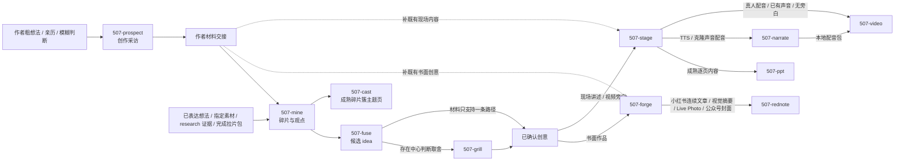
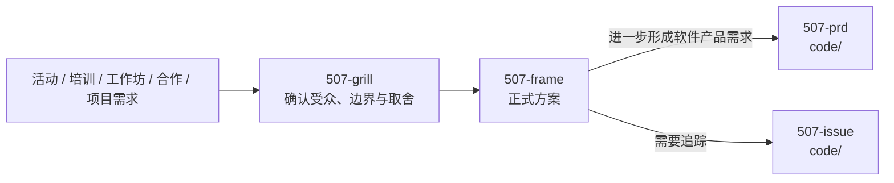
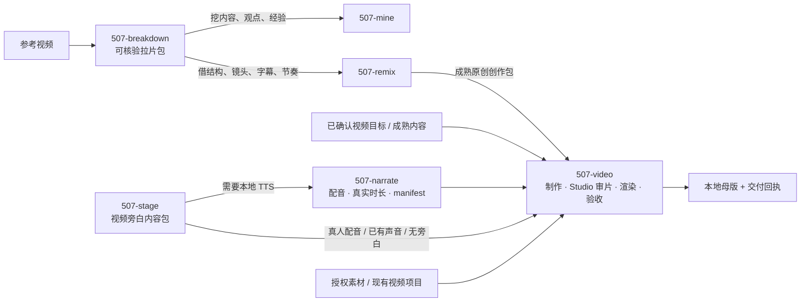

# write/ 写作与内容工作流

`write/` 处理碎片、选题、知识沉淀、书面作品、现场内容、人类方案、视频创作包、视频母版和平台适配。主创作链保留冶金隐喻；视频、舞台、方案与平台适配使用各自领域的动作名。

`common/` 是横向层：任何写作阶段遇到项目未知、概念障碍、外部证据或用户取舍，都可以调用 `explore`、`explain`、`research` 或 `grill`，解决后返回。它们不是写作前必须依次跑完的仪式。

## 三类入口

### 1. 素材、观点与知识


```mermaid
flowchart LR
    seed["作者粗想法 / 亲历 / 模糊判断"] --> prospect["507-prospect<br/>创作采访"]
    prospect --> author["作者材料交接"]
    author --> mine["507-mine<br/>碎片与观点"]
    source["已表达想法 / 指定素材 / research 证据 / 完成拉片包"] --> mine
    mine --> fuse["507-fuse<br/>候选 idea"]
    mine --> cast["507-cast<br/>成熟碎片簇主题页"]
    fuse -->|"存在中心判断取舍"| grill["507-grill"]
    grill --> selected["已确认创意"]
    fuse -->|"材料只支持一条路径"| selected
    selected -->|"书面作品"| forge["507-forge"]
    selected -->|"现场讲述 / 视频旁白"| stage["507-stage"]
    author -. "补既有书面创意" .-> forge
    author -. "补既有现场内容" .-> stage
    stage -->|"成熟逐页内容"| ppt["507-ppt"]
    stage -->|"TTS / 克隆声音配音"| narrate["507-narrate"]
    narrate -->|"本地配音包"| video["507-video"]
    stage -->|"真人配音 / 已有声音 / 无旁白"| video
    forge -->|"小红书连续文章 / 视觉摘要 / Live Photo / 公众号封面"| rednote["507-rednote"]
```

`prospect` 是可跳过的作者材料生成入口，不是所有创作的必经步骤：材料还在作者脑中时，先通过非诱导采访形成作者材料交接；已有完整口述、文本、证据或拉片包时直接进入 mine。已有创意只缺一段作者亲历时，也可以调用 prospect 补齐后返回原创作动作。

`research` 与 `mine` 不合并：research 负责把外部世界查清并交付证据；mine 负责把想法、素材或证据变成自己的可复用碎片。事实缺口可以 `mine → research → mine` 返回。

### 2. 面向人的方案


```mermaid
flowchart LR
    need["活动 / 培训 / 工作坊 / 合作 / 项目需求"] --> grill["507-grill<br/>确认受众、边界与取舍"]
    grill --> frame["507-frame<br/>正式方案"]
    frame -->|"进一步形成软件产品需求"| prd["507-prd<br/>code/"]
    frame -->|"需要追踪"| issue["507-issue<br/>code/"]
```

`frame` 服务“人如何理解、批准和行动”；具体软件产品应表现为什么行为、如何验收，归 `507-prd`。frame 不在写方案过程中重新承担用户决策确认，缺口返回 grill。

### 3. 视频


```mermaid
flowchart LR
    reference["参考视频"] --> breakdown["507-breakdown<br/>可核验拉片包"]
    breakdown -->|"挖内容、观点、经验"| mine["507-mine"]
    breakdown -->|"借结构、镜头、字幕、节奏"| remix["507-remix"]
    remix -->|"成熟原创创作包"| production["507-video<br/>制作 · Studio 审片 · 渲染 · 验收"]
    confirmed["已确认视频目标 / 成熟内容"] --> production
    narration["507-stage<br/>视频旁白内容包"] -->|"需要本地 TTS"| narrate["507-narrate<br/>配音 · 真实时长 · manifest"]
    narrate --> production
    narration -->|"真人配音 / 已有声音 / 无旁白"| production
    assets["授权素材 / 现有视频项目"] --> production
    production --> master["本地母版 + 交付回执"]
```

`breakdown` 负责参考片取证；`mine` 消费内容；`remix` 消费创作手法；`video` 消费成熟内容/创作包和授权素材，止于经审片与验收的本地母版。用户自己的录像只作为成片素材时直接进入 `video`，不先跑完整拉片。

## 冶金主链

```text
prospect（探矿，可选） → mine（挖掘） → fuse（融合） → forge（锻造）
未表达材料变作者材料交接  素材变碎片       碎片变候选 idea   已确认创意变书面主稿
会话                    01-碎片/         02-创意/候选/     03-作品/

cast（铸造）与 fuse 平行：成熟碎片簇 → 04-知识库/主题页
```

- **prospect** 显化作者材料与说话位置，不提供候选答案、不落盘、不查外部事实、不写正文；
- **mine** 区分独立材料单元与重复改写，不做系统外搜、不产选题、不写正文；
- **fuse** 比较竞争解释、判断材料负载与作品边界并产候选，不替用户拍板中心判断；
- **forge** 只在写作合同、说话位置、材料与证据承重成立后成文，并在初稿后执行书面审计；
- **cast** 只聚合碎片链接与元信息，不把主题页写成长文。

## Skill 边界

### `507-prospect` 创作采访

输入是作者尚未充分表达的粗想法、亲历、直觉或既有作品中的一手材料缺口；按材料可问边界自适应组轮次：同一材料单元优先用中性提示接住连续叙述，从彼此独立的开放缺口中每轮只取信息增益最高的 2～3 个集中问，答案会改变后续题意、涉及矛盾或敏感信息时才逐题。按当前目标显化作者与主题的真实关系、信息来路、当前触发和推测边界，已有答案时不为填表追加采访。它不提供候选或推荐，不把 Agent 推断写成作者观点，也不直接落碎片、产候选或写正文。文字和语音转写只是输入方式，不绑定具体录音或转写产品。

### `507-mine` 碎片挖掘

输入是已经表达的用户想法、prospect 作者材料交接、指定素材、research 证据交接或 `video_completed` 拉片包；先查既有碎片/作品/知识库去重和互链，再把判断对象或关系、来源、动作、结果、机制、反例或边界确实不同的内容整理为独立材料单元，说明各自能承载什么。材料仍在作者脑中且用户希望通过采访补足时进入 prospect 后返回；跨来源核实、时效查证或反例搜索进入 research 后返回。mine 不替下游判断作品篇幅。

### `507-fuse` 候选融合

比较碎片背后的支持证据、反例、替代解释和边界，核对说话位置与独立材料负载，写清当前材料最多能承载的题目、篇幅、页面或时长；材料确有竞争路径时产 2～5 条候选 idea，材料只支持一条或较小体量时说明收敛理由。用户拥有的中心判断选择通过 grill 完成，Agent 再按既有交付目标路由到 forge 或 stage。

### `507-cast` 知识铸造

把成熟碎片簇聚合成 `04-知识库/` 主题页，并同步知识图谱与索引。主题结构涉及用户知识组织取舍时通过 grill 确认；不够成熟时继续留在碎片图谱生长。

### `507-forge` 书面成文

把已确认创意、写作合同和承重证据统一写成可发布主稿。动笔前核对说话位置、独立材料与篇幅边界，初稿后再按专用参考检查段落推进、表达、事实与结尾，并以只读脚本提醒对比句、标点、句长、重复开场等形状。尚未表达的作者材料缺口进 prospect，已表达材料的碎片缺口进 mine，外部事实缺口进 research，候选范围或竞争解释进 fuse，中心判断取舍进 grill；完成后可直接结束或进入 rednote/stage。

### `507-stage` 现场讲述

把已确认的听众、场景、时长、目标和内容编排成演讲稿、PPT 逐页稿、课程、企业培训内容或视频旁白内容包。编排前核对讲者位置、独立材料与载体边界，每页/每段只推进一个认知台阶；初稿后执行现场内容审计、朗读和独立口播脚本提醒。内容未收口时不进入视觉制作。成熟逐页内容进入 `507-ppt`；成熟视频旁白需要本地 TTS 时进入 `507-narrate`，已有真人/现成音频或无需旁白时可直接进入 `507-video`。

### `507-ppt` 视觉幻灯片

消费成熟逐页内容包，以“语义组件 × 设计语言 × 视觉呈现”建立独立 visual-plan：Agent 先按内容推荐 2～3 组真实内容原型，用户可整组选中或自由混合，混合后以合并原型再次确认；命名样式只是已验证 preset，不是底层分类。一套 deck 使用一个基础设计语言和受控逐页 treatment，呈现按页选择并通过兼容矩阵；核心组合同时生成可编辑 `.pptx` 与离线单文件 HTML，适配实现显式记录降级。交付包含 notes、alt、来源/notice、中文语义换行和双载体验证证据；不编排未收口内容，不做小红书图卡。

### `507-narrate` 本地配音

消费成熟旁白与已授权、已在 Voicebox 由人确认的声音档案，通过本地 REST API 按 `daily`（Qwen 0.6B）或 `precision`（Qwen 1.7B）生成配音，两者默认以 `1.2×` 保留音高变速；按最终 WAV 真实帧数与时长输出可被视频时间线消费的 `narration-manifest.json`。不创建声音档案、不写稿、不使用 MCP，也不制作或发布视频。

### `507-frame` 人类方案

消费 grill 已确认的需求与边界，写活动、培训、工作坊、合作提案或项目计划。写法、章节和呈现由 Agent 自主完成；用户意图缺口返回 grill，软件产品规格进入 PRD。

### `507-breakdown` 视频拉片

将一个视频经 MiniMax-M3 整段理解、本地文本定位、受限视觉搜索、自适应抽帧和图片证据回写，编译成 validator 通过的 `video_completed` 拉片包。时间窗只能由本地证据承重。

### `507-remix` 视频借鉴重组

只消费一个或多个完成拉片包，借结构、叙事、镜头、字幕和节奏模式，明确不借逐句内容、人物身份和品牌资产，输出人读创作包与工具无关 `prompt-pack.json`；需要进入制作时补齐声音/时间来源、证据、素材和隐私边界，再交给 `507-video`，不直接生成成片。

### `507-video` 视频制作

消费已确认的视频目标、成熟内容、`507-narrate` 本地配音包、真人/已有声音、`507-remix` 原创创作包、授权素材和现有项目。当前首选 Remotion，负责制作合同归一、素材清单、真实时间基准、字幕/音频、Studio 审片循环、当前版本明确确认后的渲染，以及技术和视觉验收；止于本地母版与交付回执，不负责生成克隆声音、平台登录或发布。网站、桌面端或移动端产品宣传片仍由本 skill 的条件 profile 承接：从产品事实与设计令牌建立 styleframe，完成必须展示功能到可选镜头语法的映射，分镜放行后采集真实页面，并在最终渲染确认前完成独立关键帧终检；不另建总控 skill，也不包含剪映 / CapCut 可编辑工程导出。

### `507-rednote` 小红书图文

把成熟书面主稿编辑为小红书图文：用户只说“小红书图文 / 图卡”时，默认在本地动态工作台中排成连续文章，以语义组件、设计语言和视觉呈现三轴生成最终 DOM，再实测切成统一 3:4 阅读页；明确要求视觉摘要时才提炼为一页一个观点。`content.md`、`visual-plan.json` 和只读 `paged-content.json` 分别承担平台稿、视觉决定和真实分页，动态预览与 PNG/JPG/PDF 使用同一 runtime。两种模式也可把用户选定短视频放入动态图片槽并打包 Live Photo，或生成独立构图的公众号 `21:9 + 1:1` 封面对。不负责长视频剪辑、公众号正文、账号登录和发布。

## 产物接力

| 上游产物 | 可被谁消费 | 说明 |
| --- | --- | --- |
| prospect 作者材料交接 | mine / forge / stage / 直接结束 | 作者明确表达的一手材料、说话位置、未确认线索与外部事实缺口彼此分开；事实缺口进 research，真实取舍进 grill |
| research 证据交接 | mine / forge / stage / grill | 外部事实与来源边界 |
| mine 碎片与材料交接 | fuse / cast | 独立材料单元、观点、经验、问题、能承载什么和证据关系 |
| fuse 候选 idea | grill → forge / stage | 包含说话位置、材料负载与作品边界；先确认中心判断，再按交付目标成文 |
| cast 主题页 | fuse / 直接查阅 | 知识入口，不是文章正文 |
| forge 书面主稿 | rednote / stage / 直接发布 | 唯一正文真相源 |
| breakdown 拉片包 | mine / remix | 内容与创作手法分流 |
| stage 视频旁白内容包 | narrate / video | 需要本地 TTS 时进入 narrate；真人配音、已有声音或无旁白时直接进入 video |
| narrate 本地配音包 | video | 分段 WAV、真实起止时间、生成参数、授权声明与文件哈希 |
| remix 创作包 | video | 补齐制作交接后的蓝图，不是最终成片 |
| video 本地母版 + 交付回执 | 用户 / 授权后的发布流程 | 已审片、已验证，不含平台上传 |
| frame 正式方案 | PRD / issue / 人类决策 | 面向人的行动载体 |
| rednote 社交视觉包 | 授权后的发布流程 | 连续文章图片或 3:4 摘要图卡、HTML、联系表、清单，以及按需生成的 Live Photo 或公众号封面对 |

## 出口纪律

- 每个 skill 可独立触发，不强制走完整链路。
- 每个 skill 声明完成信号、产物、候选出口与回退条件；出口可以有多个。
- Agent 根据用户已表达的目标选择下一 skill 并说明理由，不让用户选择 `forge / stage / frame / remix` 等内部名称。
- 开放式显化作者已有材料进入 `507-prospect`，不给候选或推荐；需要用户在真实路径中作出取舍才进入 `507-grill`。
- 真正属于用户的内容判断、方案边界和发布承诺统一进入 `507-grill`；工程、格式、测试与渲染细节由 Agent 自主完成并告知用户。
- 共享知识库目录与流水线纪律以目标 vault（知识库）的 `AGENTS.md` 和 README 为准。
